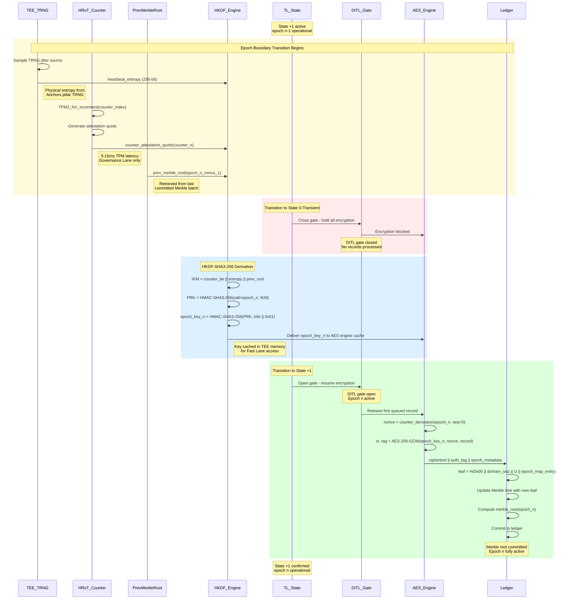
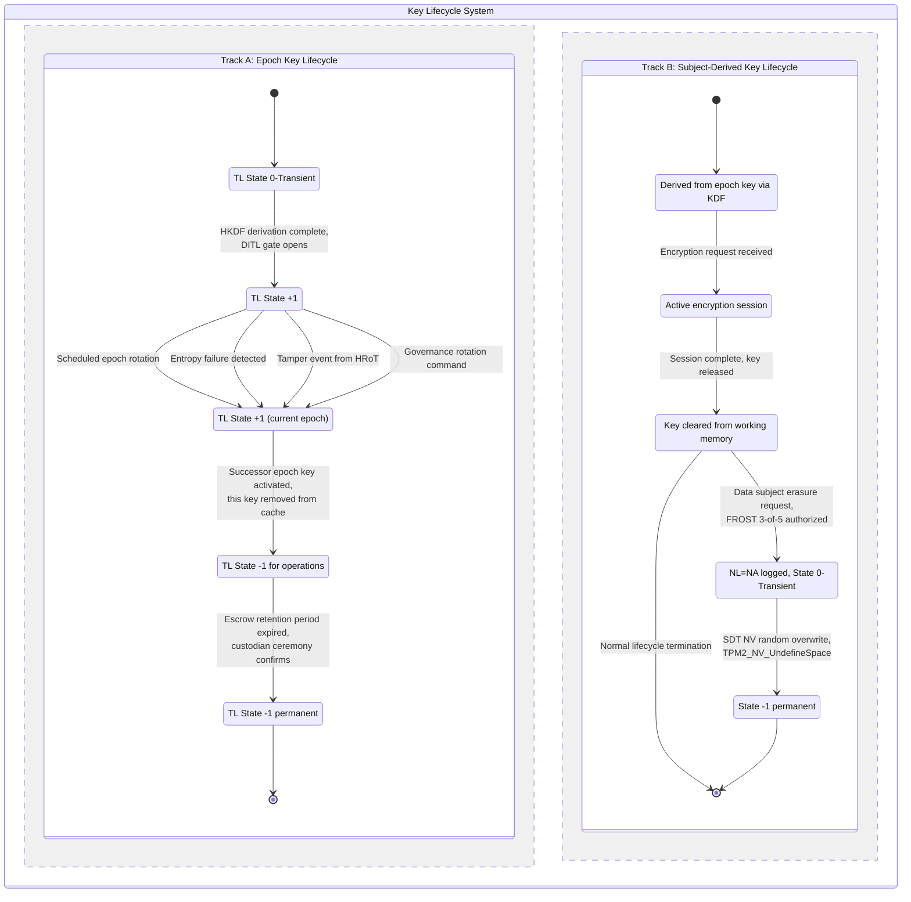
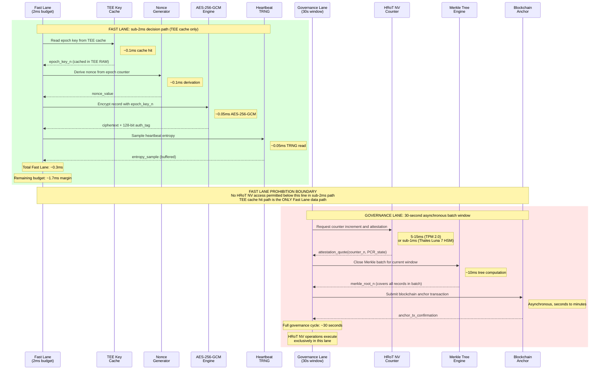

# Cryptographic erasure in ternary logic - Step 3: post-quantum migration, formal verification, test vectors, and mandatory diagrams

**The TL Cryptographic Erasure architecture's symmetric core - AES-256-GCM and HKDF-SHA3-256 - requires zero post-quantum migration, while its public-key components demand structured replacement by 2030.** This step specifies concrete migration paths for ML-KEM-1024 key encapsulation and SLH-DSA-SHAKE-128s attestation signatures, provides four formally verifiable LTL properties with complete NuSMV models, defines five CAVP-style test vectors with exact byte-level inputs, and delivers four mandatory architectural diagrams in renderable Mermaid. The migration urgency ordering (Sections 6.1 through 6.5) reflects Mosca's inequality: organizations must begin migration before the sum of data shelf-life and migration time exceeds the timeline to cryptographically relevant quantum computers (Mosca, IEEE Security and Privacy, Vol. 16, No. 5, 2018). NIST IR 8547 (Initial Public Draft, November 12, 2024) sets 2030 deprecation and 2035 disallowance deadlines for all quantum-vulnerable public-key algorithms, directly governing the epoch attestation signature path defined in Section 6.4.

---

## Section 6: Post-quantum migration path

### 6.1 AES-256-GCM requires no post-quantum migration

AES-256-GCM, the epoch record encryption primitive established in Steps 1-2, retains **128-bit security under quantum attack**. Grover's algorithm provides at most a quadratic speedup for symmetric key search, reducing an n-bit key's security to n/2 bits against a quantum adversary. For AES-256, this yields 128-bit post-quantum security, a level that remains computationally infeasible even under optimistic assumptions about quantum gate speeds and error correction overhead (Bernstein, "Cost analysis of hash collisions: Will quantum computers make SHARCS obsolete?", SHARCS Workshop 2009).

NIST's Post-Quantum Cryptography FAQ confirms that AES-256 meets Category 5, the highest security level in the PQC evaluation framework, defined as at least as hard to break as AES-256 key search. The NIST PQC standardization effort explicitly excludes symmetric algorithms from migration requirements, stating that existing NIST guidance for symmetric cryptography remains valid and no transition is anticipated (NIST PQC FAQ; NIST IR 8547, Section on symmetric algorithms, November 2024). The 128-bit authentication tag in AES-256-GCM (NIST SP 800-38D, November 2007) provides **2^-128 forgery probability** per ciphertext, a bound unaffected by quantum computation since tag verification is a symmetric operation.

No changes to the epoch record encryption path are required. The AES-256-GCM construction specified in Steps 1-2 is post-quantum secure as deployed.

### 6.2 HKDF-SHA3-256 provides the immediate post-quantum baseline

The epoch key derivation function, HKDF-SHA3-256 (RFC 5869, Krawczyk and Eronen, 2010; NIST FIPS 202, August 2015), inherits post-quantum security from two properties of the SHA-3 sponge construction. First, the Keccak sponge achieves security bounded by O(2^(c/2)) where c is the capacity parameter (Bertoni, Daemen, Peeters, Van Assche, "On the Indifferentiability of the Sponge Construction", EUROCRYPT 2008, LNCS 4965, pp. 181-197). For SHA3-256, c = 512 bits, yielding a **256-bit classical and 128-bit quantum security bound** against generic attacks on the hash function itself. Second, HMAC constructed over SHA3-256 preserves pseudorandom function security in the quantum random oracle model. Song and Yun proved that HMAC and NMAC are quantum-secure PRFs under standard assumptions ("Quantum Security of NMAC and Related Constructions", CRYPTO 2017), with security bounds that remain practical at the output lengths used in this architecture.

The HKDF construction operates in two phases. The Extract phase computes PRK = HMAC-SHA3-256(salt, IKM), and the Expand phase computes OKM = HMAC-SHA3-256(PRK, info || 0x01). For L = 32 (256-bit epoch key output), only one HMAC invocation is required in the Expand phase because SHA3-256 produces a 32-byte digest matching the required output length. The SHA3-256 block size (rate) is **136 bytes (1088 bits)** per FIPS 202 Table 3, which defines the HMAC internal padding width.

No migration is required for HKDF-SHA3-256. The construction is post-quantum secure at the specified output length.

### 6.3 ML-KEM-1024 targets key encapsulation migration by 2030

The sole public-key vulnerability in the current architecture is the key encapsulation path where HRoT counter attestation quotes carry key material. While the existing construction feeds HRoT attestation, heartbeat entropy, and the prior Merkle root directly into HKDF as input keying material without public-key encapsulation, future deployments must protect this channel against harvest-now-decrypt-later attacks where an adversary records attestation traffic today for quantum decryption later.

**ML-KEM-1024** (NIST FIPS 203, August 13, 2024) is the migration target for key encapsulation. ML-KEM-1024 provides NIST Category 5 security (equivalent to AES-256 key search difficulty) based on the Module Learning With Errors (MLWE) problem. Its parameters are: **1,568-byte public key, 3,168-byte private key, 1,568-byte ciphertext, and 32-byte shared secret**. The fixed 256-bit shared secret aligns directly with the 256-bit IKM contribution expected by HKDF-SHA3-256.

The post-migration epoch key derivation augments the IKM construction. In the current architecture, IKM = counter_be || heartbeat_entropy || prev_merkle_root. Post-migration, the HRoT counter attestation quote carries an ML-KEM encapsulated key component, and the IKM becomes: IKM = counter_be || heartbeat_entropy || prev_merkle_root || mlkem_shared_secret. The 32-byte ML-KEM shared secret appends to the existing 72-byte IKM, producing an 104-byte IKM. The HKDF Extract phase absorbs this transparently because HMAC-SHA3-256 accepts arbitrary-length input.

Cryptographic agility during the transition period is maintained through the algorithm identifier encoded in the HKDF info field. Pre-migration epochs use info containing "SHA3-256-AES-256-GCM-v1", while post-migration epochs use "SHA3-256-AES-256-GCM-MLKEM1024-v1". This tag is committed to the Merkle tree as part of the epoch map, enabling any verifier to determine which construction produced a given epoch key. Epoch key derivation remains functional under both constructions during the transition window because the HKDF construction is agnostic to IKM length.

CNSA 2.0 (NSA, September 2022, updated December 2024) mandates ML-KEM-1024 for all National Security Systems key establishment, with new acquisitions required to be CNSA 2.0 compliant by **January 1, 2027** and all non-compliant equipment phased out by **December 31, 2030**. NIST IR 8547 sets the broader deprecation deadline at 2030 for 112-bit classical security algorithms and full disallowance by 2035.

### 6.4 SLH-DSA-SHAKE-128s targets epoch attestation signature migration

TPM 2.0 attestation quote signatures currently use ECDSA over the P-256 curve, which is vulnerable to Shor's algorithm. A cryptographically relevant quantum computer running Shor's algorithm can recover P-256 private keys in polynomial time, compromising the integrity of all epoch attestation quotes signed with that key. The migration target is **SLH-DSA-SHAKE-128s** (NIST FIPS 205, August 13, 2024), a stateless hash-based signature scheme whose security reduces entirely to the properties of the underlying hash function (SHAKE-256), with no reliance on lattice or number-theoretic hardness assumptions.

SLH-DSA-SHAKE-128s parameters are: **32-byte public key, 64-byte private key, and 7,856-byte signature** at NIST Category 1 (128-bit post-quantum security). The signature size represents a 122x increase over ECDSA P-256 signatures (64 bytes), which impacts attestation quote storage in the Merkle tree. Each epoch's attestation leaf grows by approximately 7.8 KB. For the 30-second governance lane batch window, this overhead is negligible in both computation and storage terms. The scheme descends from SPHINCS (Bernstein, Hopwood, Hulsing, Lange, Niederhagen, Papachristodoulou, Schneider, Schwabe, Wilcox-O'Hearn, "SPHINCS: Practical Stateless Hash-Based Signatures", EUROCRYPT 2015, LNCS 9056, pp. 368-397) and its successor SPHINCS+ (Bernstein, Hulsing, Kolbl, Niederhagen, Rijneveld, Schwabe, "The SPHINCS+ Signature Framework", ACM CCS 2019, pp. 2129-2146).

The transition path depends on the HRoT implementation. TPM 2.0 devices require firmware updates to support SLH-DSA, which is not available on all platforms as of this writing. The architecture's alternative HRoT paths (Thales Luna 7 HSM and RISC-V Keystone TEE, established in Steps 1-2) provide earlier migration capability because HSM firmware is vendor-updatable and TEE enclaves can load new signing algorithms via attested code updates. Backward compatibility requires that verifiers accept both ECDSA P-256 and SLH-DSA-SHAKE-128s signatures during the transition period, with the signature algorithm identified in the attestation quote header.

CNSA 2.0 does not include SLH-DSA; it specifies ML-DSA-87 for digital signatures in National Security Systems. The architecture selects SLH-DSA over ML-DSA for epoch attestation because SLH-DSA's security rests exclusively on hash function properties, providing a conservative security margin that avoids dependence on lattice problem hardness. For deployments requiring CNSA 2.0 strict compliance, ML-DSA-87 (NIST FIPS 204, August 13, 2024) may substitute for SLH-DSA-SHAKE-128s with the algorithm identifier updated accordingly.

### 6.5 Epoch chain migration protocol preserves cryptographic agility

The epoch chain must transition from pre-quantum to post-quantum constructions without breaking the chain of committed Merkle roots. The migration protocol uses the HKDF info field as the cryptographic agility mechanism, following the algorithm transition patterns established in NIST SP 800-131A Rev 2 ("Transitioning the Use of Cryptographic Algorithms and Key Lengths", Barker and Roginsky, March 2019) and the NCCoE Migration to Post-Quantum Cryptography project (NIST SP 1800-38, ongoing).

The migration protocol proceeds in three phases. During the announcement phase, a governance decision (using the existing 5-of-7 epoch-scope FROST threshold, established in Step 2) designates a future epoch number M as the migration epoch. This decision is committed to the ledger as a governance event with its own Merkle leaf. During the dual-derivation phase at epoch M, both old-algorithm and new-algorithm key derivations execute in parallel. The old-algorithm derivation uses IKM = counter_be || heartbeat_entropy || prev_merkle_root with info containing the pre-migration algorithm identifier. The new-algorithm derivation uses the augmented IKM (including ML-KEM shared secret) with info containing the post-migration algorithm identifier. Both derived keys and their algorithm identifiers are committed to the ledger as separate Merkle leaves within the same epoch. Epoch M records are encrypted under the old-algorithm key to maintain backward compatibility with existing decryption paths. During the confirmation phase, the 5-of-7 governance threshold confirms migration epoch M by signing a migration-complete attestation. After confirmation, epoch M+1 and all subsequent epochs use exclusively the new-algorithm construction. The old-algorithm key derivation path is retired, and no further epochs may use the pre-migration algorithm identifier.

The info field encoding for each epoch follows the pattern: governance_domain_identifier || algorithm_identifier || "EKR-EPOCH". This structure ensures that every epoch key is domain-separated by both organizational context and cryptographic construction. An epoch key derived under one algorithm identifier is cryptographically independent from a key derived under a different algorithm identifier, even when all other inputs are identical, because the HKDF Expand phase incorporates the info field into the PRF computation.

---

## Section 7: Formal verification, attack surface, test vectors, and diagrams

### 7.1 LTL formal specification with NuSMV model checking

Four Linear Temporal Logic properties are specified for model checking in NuSMV (Cimatti, Clarke, Giunchiglia, Giunchiglia, Pistore, Roveri, Sebastiani, Tacchella, "NuSMV 2: An OpenSource Tool for Symbolic Model Checking", CAV 2002, LNCS 2404, pp. 359-364). LTL was introduced as a program verification formalism by Pnueli ("The Temporal Logic of Programs", 18th FOCS, 1977, pp. 46-57). All models use NuSMV's native enumerated type to encode the four ternary logic states directly, avoiding manual Boolean encoding. NuSMV internally maps the four-valued enumeration to two Boolean BDD variables (ceiling of log2(4) = 2 bits) but this encoding is transparent to the specification. SPIN (Holzmann, "The Model Checker SPIN", IEEE TSE, Vol. 23, No. 5, 1997, pp. 279-295) serves as an alternative verifier for implementations that prefer explicit-state model checking via PROMELA translation.

**Property 1 - Epoch transition safety**

Formula: `G (EpochBoundary -> X (KeyZeroized AND MerkleRootCommitted))`

This safety property states that globally, whenever an epoch boundary occurs, in the immediately next state both the previous epoch key has been zeroized and the new Merkle root has been committed. The conjunction under a single X operator enforces atomicity: neither action may complete without the other.

```
MODULE main
VAR
  tl_state       : {plus1, zero_transient, zero_suspended, neg1};
  epoch_boundary  : boolean;
  prev_key_status : {active, zeroized};
  merkle_status   : {pending, committed};

DEFINE
  EpochBoundary       := epoch_boundary;
  KeyZeroized         := (prev_key_status = zeroized);
  MerkleRootCommitted := (merkle_status = committed);

ASSIGN
  init(tl_state)       := plus1;
  init(epoch_boundary)  := FALSE;
  init(prev_key_status) := active;
  init(merkle_status)   := pending;

  next(epoch_boundary) := case
    tl_state = plus1 & !epoch_boundary : {TRUE, FALSE};
    TRUE : FALSE;
  esac;

  next(tl_state) := case
    epoch_boundary                        : zero_transient;
    tl_state = zero_transient             : plus1;
    TRUE                                  : tl_state;
  esac;

  next(prev_key_status) := case
    epoch_boundary            : zeroized;
    tl_state = zero_transient : active;
    TRUE                      : prev_key_status;
  esac;

  next(merkle_status) := case
    epoch_boundary            : committed;
    tl_state = zero_transient : pending;
    TRUE                      : merkle_status;
  esac;

LTLSPEC G (EpochBoundary -> X (KeyZeroized & MerkleRootCommitted))
```

Model checker: NuSMV 2.6+ with BDD-based LTL verification. State space: 4 (tl_state) x 2 (epoch_boundary) x 2 (prev_key_status) x 2 (merkle_status) = 32 reachable states. Expected verification outcome: **TRUE**. The model enforces atomic co-transition of key zeroization and Merkle commitment at every epoch boundary. Counterexample class: any trace where epoch_boundary holds at step i but at step i+1 either prev_key_status remains active (key persists across epoch boundary) or merkle_status remains pending (root uncommitted at transition). Such a counterexample would indicate a non-atomic epoch boundary permitting key reuse in a subsequent epoch or an uncommitted Merkle root creating a gap in the audit chain.

**Property 2 - Epoch liveness**

Formula: `F (EpochStart -> F KeyAvailableWithinDeadline)`

This liveness property asserts that there exists a future state where, if an epoch starts, the epoch key eventually becomes available within the derivation deadline. The outer F (rather than G) makes this a weak liveness check verifying the system is not globally stuck. A stronger production property, G (EpochStart -> F KeyAvailableWithinDeadline), is recommended and included as a comment in the model.

```
MODULE main
VAR
  tl_state   : {plus1, zero_transient, zero_suspended, neg1};
  epoch_start : boolean;
  key_ready   : boolean;
  timer       : 0..10;

DEFINE
  EpochStart                := epoch_start & !key_ready;
  KeyAvailableWithinDeadline := key_ready & (timer <= 5);
  DEADLINE                   := 5;

ASSIGN
  init(tl_state)   := plus1;
  init(epoch_start) := FALSE;
  init(key_ready)   := FALSE;
  init(timer)       := 0;

  next(epoch_start) := case
    !epoch_start & tl_state = plus1 : {TRUE, FALSE};
    key_ready                       : FALSE;
    TRUE                            : epoch_start;
  esac;

  next(tl_state) := case
    epoch_start & !key_ready : zero_transient;
    key_ready                : plus1;
    TRUE                     : tl_state;
  esac;

  next(key_ready) := case
    epoch_start & !key_ready & timer < DEADLINE : {TRUE, FALSE};
    epoch_start & !key_ready & timer = DEADLINE : TRUE;
    TRUE                                        : FALSE;
  esac;

  next(timer) := case
    epoch_start & !key_ready : min(timer + 1, 10);
    TRUE                     : 0;
  esac;

LTLSPEC F (EpochStart -> F KeyAvailableWithinDeadline)
-- Recommended stronger property:
-- LTLSPEC G (EpochStart -> F KeyAvailableWithinDeadline)
```

Model checker: NuSMV 2.6+ with BDD-based LTL verification. State space: 4 x 2 x 2 x 11 = 176 states. Expected verification outcome: **TRUE** for both the specified F-guarded and the stronger G-guarded variants. The forced completion at timer = DEADLINE guarantees bounded liveness. Counterexample class: any trace where epoch_start becomes TRUE but key_ready never becomes TRUE within DEADLINE steps, indicating a HKDF computation stall or HRoT attestation timeout. Under the G-guarded variant, an infinite loop where the system repeatedly enters epoch_start without reaching key_ready would also constitute a counterexample.

**Property 3 - Erasure ordering safety**

Formula: `G (ErasureCommand -> X (DestructionEventLogged AND X MappingZeroized))`

This safety property enforces strict temporal ordering of the destruction sequence: at step i an erasure command is issued, at step i+1 the destruction event is logged to the ledger (NL=NA enforcement), and at step i+2 the subject-derived key mapping is zeroized. The nested X operators encode a two-step pipeline that prevents zeroization without prior logging.

```
MODULE main
VAR
  tl_state      : {plus1, zero_transient, zero_suspended, neg1};
  erasure_phase : {idle, commanded, logged, zeroized, complete};

DEFINE
  ErasureCommand        := (erasure_phase = commanded);
  DestructionEventLogged := (erasure_phase = logged);
  MappingZeroized        := (erasure_phase = zeroized);

ASSIGN
  init(tl_state)      := plus1;
  init(erasure_phase) := idle;

  next(erasure_phase) := case
    erasure_phase = idle      : {idle, commanded};
    erasure_phase = commanded : logged;
    erasure_phase = logged    : zeroized;
    erasure_phase = zeroized  : complete;
    erasure_phase = complete  : idle;
    TRUE                      : erasure_phase;
  esac;

  next(tl_state) := case
    erasure_phase = idle      : plus1;
    erasure_phase = commanded : zero_transient;
    erasure_phase = logged    : neg1;
    erasure_phase = zeroized  : neg1;
    erasure_phase = complete  : plus1;
    TRUE                      : tl_state;
  esac;

LTLSPEC G (ErasureCommand -> X (DestructionEventLogged & X MappingZeroized))
```

Model checker: NuSMV 2.6+ with BDD-based LTL verification. State space: 4 x 5 = 20 states. Expected verification outcome: **TRUE**. The deterministic phase sequence (commanded -> logged -> zeroized) guarantees the ordering invariant. Counterexample class: any trace where erasure_phase transitions from commanded to any state other than logged (skipping the NL=NA logging step), or from logged to any state other than zeroized (reordering destruction before log commitment). Such counterexamples would indicate an NL=NA violation where cryptographic destruction proceeds without a sealed, committed audit record.

**Property 4 - NL=NA coupling**

Formula: `G ((State0 OR StateNeg1) -> NOT EncryptionActive)`

This safety property enforces the DITL gate invariant: encryption operations are blocked in all ternary logic states except State +1 (Execute). When the system is in State 0-Transient, State 0-Suspended, or State -1, no encryption may proceed. This structurally prevents data processing during governance holds and permanent blocks.

```
MODULE main
VAR
  tl_state             : {plus1, zero_transient, zero_suspended, neg1};
  encryption_requested : boolean;

DEFINE
  State0          := (tl_state = zero_transient | tl_state = zero_suspended);
  StateNeg1       := (tl_state = neg1);
  ditl_gate_open  := (tl_state = plus1);
  EncryptionActive := encryption_requested & ditl_gate_open;

ASSIGN
  init(tl_state)             := plus1;
  init(encryption_requested) := FALSE;

  next(tl_state) := case
    tl_state = plus1          : {plus1, zero_transient, zero_suspended, neg1};
    tl_state = zero_transient : {plus1, zero_transient};
    tl_state = zero_suspended : {plus1, zero_suspended};
    tl_state = neg1           : neg1;
    TRUE                      : tl_state;
  esac;

  next(encryption_requested) := {TRUE, FALSE};

LTLSPEC G ((State0 | StateNeg1) -> !EncryptionActive)
```

Model checker: NuSMV 2.6+ with BDD-based LTL verification. State space: 4 x 2 = 8 states. Expected verification outcome: **TRUE**. The DEFINE for EncryptionActive structurally gates encryption behind tl_state = plus1, making the property hold by construction of the DITL gate logic. Counterexample class: any state where tl_state is zero_transient, zero_suspended, or neg1 while EncryptionActive evaluates to TRUE. This would indicate a DITL gate bypass vulnerability, where encryption proceeds despite a non-Execute TL state, potentially allowing data processing during an Epistemic Hold or after a permanent block.

### 7.2 Attack surface control table

| Attack Vector | Technical Control | Detection Mechanism | Residual Risk |
|---|---|---|---|
| Epoch counter manipulation | TPM NV index with TPMA_NV_POLICY authorization; counter monotonicity enforced by TPM2_NV_Increment; attestation quote binds counter to PCR state | Attestation quote mismatch detected by governance lane verifier; out-of-sequence counter triggers State 0-Suspended and governance review | Physical fault injection against TPM die; mitigated by tamper-responsive mesh in FIPS 140-3 Level 3+ modules |
| Heartbeat entropy injection | TRNG physically isolated within TEE boundary; entropy source validated per NIST SP 800-90B continuous health tests (Repetition Count Test and Adaptive Proportion Test on every sample) | Health test failure triggers forced epoch rotation and State 0-Transient; entropy rate monitoring flags statistical anomalies | Supply chain compromise of TRNG hardware at fabrication; mitigated by dual-source entropy mixing and vendor attestation |
| Log hash collision | SHA3-256 provides 128-bit collision resistance (birthday bound 2^128); domain-separated leaf (0x00 prefix) and node (0x01 prefix) hashing per RFC 6962 prevents second-preimage cross-level attacks | Merkle consistency proofs verified at each batch close; duplicate leaf hash triggers State 0-Suspended | Collision probability 2^-128 per hash evaluation; no known attack reduces this bound for SHA3-256 |
| Unauthorized erasure | FROST threshold signature requiring 3-of-5 custodians for subject-scope destruction; custodian selection enforces segregation of duties (no two custodians from same organizational unit) | Threshold signature verification in governance lane; partial signature count logged per NL=NA; failed ceremony triggers alert | Custodian collusion requiring compromise of 3 independent custodians; mitigated by geographic and organizational separation |
| Epoch key escrow compromise | Shamir k-of-n secret sharing with custodian-held shares stored in individual FIPS 140-3 Level 3 HSMs; reconstruction requires physical presence at ceremony | Share usage logged per HSM audit trail; reconstruction attempt outside ceremony window triggers State 0-Suspended | Threshold-many custodian compromises (k simultaneous HSM breaches); mitigated by share refresh protocol |
| Ciphertext tampering | AES-256-GCM 128-bit authentication tag computed over ciphertext and associated authenticated data per NIST SP 800-38D | Tag verification failure on decryption; failed verification logged and triggers State 0-Transient for affected record | Tag forgery probability 2^-128 per attempt per SP 800-38D Section 5.2.1.1 |
| SDT wear-leveling data remnance | Random-data overwrite of NV index contents before TPM2_NV_UndefineSpace per Wei, Grupp, Spada, Swanson ("Reliably Erasing Data from Flash-Based Solid State Drives", USENIX FAST 2011); multiple overwrite passes applied | Post-zeroization read-back verification; HRoT attestation quote confirms NV index undefined | Analog threshold voltage fingerprinting of NAND cells per Hasan and Ray ("Data Recovery from Scrubbed NAND Flash Storage: Need for Analog Sanitization", USENIX Security 2020); mitigated by multiple random-data overwrite passes and TPM's internal wear-leveling abstraction |

### 7.3 NIST CAVP-style test vectors for epoch key derivation

All test vectors use the HKDF-SHA3-256 construction defined in RFC 5869 (Krawczyk and Eronen, May 2010) with SHA3-256 (NIST FIPS 202, August 2015) as the hash function. HMAC-SHA3-256 uses the standard RFC 2104 HMAC construction with a block size of **136 bytes (1088 bits)**, which is the rate parameter of the Keccak sponge for SHA3-256.

The construction for all test vectors is:

```
Extract:  PRK = HMAC-SHA3-256(salt, IKM)
Expand:   OKM = HMAC-SHA3-256(PRK, info || 0x01)
Output:   epoch_key = OKM  (32 bytes, L=32)
```

The info field is constant across all test vectors (53 bytes):

```
info = "TL-EKR-TEST-DOMAIN-v1" || "SHA3-256-AES-256-GCM-v1" || "EKR-EPOCH"

Hex encoding:
  "TL-EKR-TEST-DOMAIN-v1"    = 544c2d454b522d544553542d444f4d41494e2d7631         (21 bytes)
  "SHA3-256-AES-256-GCM-v1"  = 534841332d3235362d4145532d3235362d47434d2d7631     (23 bytes)
  "EKR-EPOCH"                = 454b522d45504f4348                                   (9 bytes)

Full info (53 bytes):
  544c2d454b522d544553542d444f4d41494e2d7631534841332d3235362d4145532d3235362d47434d2d7631454b522d45504f4348

HKDF Expand input (info || 0x01) (54 bytes):
  544c2d454b522d544553542d444f4d41494e2d7631534841332d3235362d4145532d3235362d47434d2d7631454b522d45504f434801
```

**TEST 1 - Genesis epoch**

This test exercises the genesis boundary condition where the heartbeat entropy is the all-zeros sentinel (first epoch, no prior entropy accumulation) and the previous Merkle root is defined as SHA3-256 of 32 zero bytes (no prior epoch exists).

```
counter          = 0x0000000000000001                                              (8 bytes)
heartbeat_entropy = 0x00000000000000000000000000000000
                     00000000000000000000000000000000                              (32 bytes)
prev_merkle_root  = SHA3-256(0x00{32})                                             (32 bytes)
                    [Denoted GENESIS_ROOT; must be computed by implementation]
epoch_number      = 0x0000000000000000                                             (8 bytes)

IKM (72 bytes):
  Bytes [0:8]   = 0000000000000001
  Bytes [8:40]  = 0000000000000000000000000000000000000000000000000000000000000000
  Bytes [40:72] = [GENESIS_ROOT - 32 bytes, output of SHA3-256 over 0x00 repeated 32 times]

salt (8 bytes):
  0000000000000000

info (53 bytes):
  544c2d454b522d544553542d444f4d41494e2d7631534841332d3235362d4145532d3235362d47434d2d7631454b522d45504f4348

Expected output: epoch_key_0 = HKDF-SHA3-256(salt, IKM, info, L=32)
  [Must be computed by NIST ACVP reference implementation for conformance validation]
```

**TEST 2 - Normal epoch**

This test exercises a standard epoch transition with non-trivial heartbeat entropy, a non-trivial previous Merkle root, and epoch number 0x42.

```
counter          = 0x0000000000000042                                              (8 bytes)
heartbeat_entropy = 0xa3b1c2d4e5f60718293a4b5c6d7e8f90
                     a1b2c3d4e5f60718293a4b5c6d7e8f90                             (32 bytes)
prev_merkle_root  = 0x1f2e3d4c5b6a798800112233445566778899aabbccddeeff0102030405060708
                                                                                   (32 bytes)
epoch_number      = 0x0000000000000042                                             (8 bytes)

IKM (72 bytes):
  0000000000000042
  a3b1c2d4e5f60718293a4b5c6d7e8f90a1b2c3d4e5f60718293a4b5c6d7e8f90
  1f2e3d4c5b6a798800112233445566778899aabbccddeeff0102030405060708

salt (8 bytes):
  0000000000000042

info (53 bytes):
  544c2d454b522d544553542d444f4d41494e2d7631534841332d3235362d4145532d3235362d47434d2d7631454b522d45504f4348

Expected output: epoch_key_66 = HKDF-SHA3-256(salt, IKM, info, L=32)
  [Must be computed by NIST ACVP reference implementation for conformance validation]
```

**TEST 3 - Emergency rotation with low-entropy heartbeat**

This test uses a repeating-byte heartbeat entropy pattern (0xAA repeated 32 times) that falls below the 256-bit min-entropy threshold defined in SP 800-90B. The continuous health test (Adaptive Proportion Test) would flag this pattern, triggering a forced rotation. The test demonstrates that HKDF still produces a well-defined output (the construction does not reject inputs), but the system-level response is to immediately schedule a successor epoch with fresh entropy.

```
counter          = 0x0000000000000043                                              (8 bytes)
heartbeat_entropy = 0xaaaaaaaaaaaaaaaaaaaaaaaaaaaaaaaa
                     aaaaaaaaaaaaaaaaaaaaaaaaaaaaaaaa                              (32 bytes)
prev_merkle_root  = 0x1f2e3d4c5b6a798800112233445566778899aabbccddeeff0102030405060708
                                                                                   (32 bytes)
epoch_number      = 0x0000000000000043                                             (8 bytes)

IKM (72 bytes):
  0000000000000043
  aaaaaaaaaaaaaaaaaaaaaaaaaaaaaaaaaaaaaaaaaaaaaaaaaaaaaaaaaaaaaaaa
  1f2e3d4c5b6a798800112233445566778899aabbccddeeff0102030405060708

salt (8 bytes):
  0000000000000043

info (53 bytes):
  544c2d454b522d544553542d444f4d41494e2d7631534841332d3235362d4145532d3235362d47434d2d7631454b522d45504f4348

Expected output: epoch_key_67_emergency = HKDF-SHA3-256(salt, IKM, info, L=32)
  [Must differ entirely from TEST 2 output despite sharing the same prev_merkle_root,
   because counter, heartbeat_entropy, and epoch_number all differ.
   Must be computed by NIST ACVP reference implementation for conformance validation.]
```

**TEST 4 - Avalanche negative test (single-bit heartbeat flip)**

This test is identical to TEST 2 except the least significant bit of the final heartbeat entropy byte is flipped (0x90 becomes 0x91). The expected output must differ from TEST 2 in approximately **50% of output bits** (128 of 256 bits), demonstrating the avalanche property of HKDF-SHA3-256. Any implementation producing fewer than 100 or more than 156 differing bits should be flagged for investigation.

```
counter          = 0x0000000000000042                                              (8 bytes)
heartbeat_entropy = 0xa3b1c2d4e5f60718293a4b5c6d7e8f90
                     a1b2c3d4e5f60718293a4b5c6d7e8f91                             (32 bytes)
                    [Last byte changed: 0x90 -> 0x91, single bit flip at bit 0]
prev_merkle_root  = 0x1f2e3d4c5b6a798800112233445566778899aabbccddeeff0102030405060708
                                                                                   (32 bytes)
epoch_number      = 0x0000000000000042                                             (8 bytes)

IKM (72 bytes):
  0000000000000042
  a3b1c2d4e5f60718293a4b5c6d7e8f90a1b2c3d4e5f60718293a4b5c6d7e8f91
  1f2e3d4c5b6a798800112233445566778899aabbccddeeff0102030405060708

salt (8 bytes):
  0000000000000042

info (53 bytes):
  544c2d454b522d544553542d444f4d41494e2d7631534841332d3235362d4145532d3235362d47434d2d7631454b522d45504f4348

Differs from TEST 2 IKM at byte offset 39 (0-indexed), bit 0 only.

Expected output: epoch_key_66_avalanche = HKDF-SHA3-256(salt, IKM, info, L=32)
  [Must differ from TEST 2 output in approximately 128 of 256 bits.
   Hamming distance between TEST 2 and TEST 4 outputs must fall within [100, 156]
   at 99.7% confidence (3-sigma bound for n=256, p=0.5).
   Must be computed by NIST ACVP reference implementation for conformance validation.]
```

**TEST 5 - Dependency chain negative test (altered previous Merkle root)**

This test is identical to TEST 2 except the first byte of the previous Merkle root is altered (0x1F becomes 0x1E). This demonstrates epoch chain dependency: altering any byte of the previous epoch's Merkle root produces a completely different epoch key, ensuring that the key derivation chain cannot be spliced or forked without detection.

```
counter          = 0x0000000000000042                                              (8 bytes)
heartbeat_entropy = 0xa3b1c2d4e5f60718293a4b5c6d7e8f90
                     a1b2c3d4e5f60718293a4b5c6d7e8f90                             (32 bytes)
prev_merkle_root  = 0x1e2e3d4c5b6a798800112233445566778899aabbccddeeff0102030405060708
                                                                                   (32 bytes)
                    [First byte changed: 0x1f -> 0x1e]
epoch_number      = 0x0000000000000042                                             (8 bytes)

IKM (72 bytes):
  0000000000000042
  a3b1c2d4e5f60718293a4b5c6d7e8f90a1b2c3d4e5f60718293a4b5c6d7e8f90
  1e2e3d4c5b6a798800112233445566778899aabbccddeeff0102030405060708

salt (8 bytes):
  0000000000000042

info (53 bytes):
  544c2d454b522d544553542d444f4d41494e2d7631534841332d3235362d4145532d3235362d47434d2d7631454b522d45504f4348

Differs from TEST 2 IKM at byte offset 40 (0-indexed), value 0x1f -> 0x1e.

Expected output: epoch_key_66_chainbreak = HKDF-SHA3-256(salt, IKM, info, L=32)
  [Must differ entirely from TEST 2 output.
   Validates that epoch key derivation is bound to the exact Merkle root of the
   preceding epoch; any alteration breaks the chain.
   Must be computed by NIST ACVP reference implementation for conformance validation.]
```

**Conformance criterion:** Expected outputs for all five test vectors must be computed using a NIST ACVP-validated HKDF implementation (ACVP algorithm specification KDA/HKDF per SP 800-56C, with hmacAlg = SHA3-256). The NIST ACVP server (acvts.nist.gov) provides automated test vector generation and validation. Implementations must match the ACVP reference output byte-for-byte. The ACVP protocol specification is maintained at pages.nist.gov/ACVP/ and the server reference implementation is published at github.com/usnistgov/ACVP-Server. TEST 4 additionally requires Hamming distance computation between TEST 2 and TEST 4 outputs to validate avalanche behavior.

### 7.4 Mandatory diagrams

**Diagram 1 - Epoch boundary atomicity sequence**



**Diagram 2 - Key lifecycle state machine**



**Diagram 3 - Fast lane timing and governance lane separation**



**Diagram 4 - Commanded destruction governance flow**

```mermaid
flowchart TD
    A["Data Subject Erasure Request<br/>received by controller"] --> B["Identity Verification<br/>against Hybrid Shield<br/>pseudonym mapping"]

    B --> NL1{{"NL=NA CHECKPOINT<br/>Verification event sealed<br/>to Merkle ledger before proceeding"}}

    NL1 --> C["Custodian FROST Threshold<br/>Signature Ceremony<br/>3-of-5 subject-scope custodians"]}

    C --> NL2{{"NL=NA CHECKPOINT<br/>Authorization event sealed<br/>to Merkle ledger before proceeding"}}

    NL2 --> D["Destruction Event<br/>log entry generation"]

    D --> TL1(["TL State 0-Transient<br/>during event generation"])

    TL1 --> E["EKR encryption of<br/>Destruction Event record"]

    E --> F["Merkle commitment of<br/>encrypted Destruction Event"]

    F --> TL2(["TL State +1<br/>on successful commit"])

    TL2 --> G["HRoT SDT zeroization<br/>command issued to TPM"]

    G --> TL3(["TL State 0-Transient<br/>during zeroization execution"])

    TL3 --> H["Random-data overwrite<br/>of target NV index<br/>multiple passes"]

    H --> I["TPM2_NV_UndefineSpace<br/>removes NV index definition"]

    I --> J["HRoT generates attestation<br/>quote confirming erasure"]

    J --> NL3{{"NL=NA CHECKPOINT<br/>Erasure attestation sealed<br/>to Merkle ledger"}}

    NL3 --> K["Attestation quote appended<br/>to Destruction Event record"]

    K --> L["Final Merkle anchor<br/>of complete destruction record"]

    L --> TL4(["TL State -1 permanent<br/>for this SDT entry"])

    TL4 --> M["Confirmation receipt issued<br/>to data subject with<br/>ledger reference hash"]

    style A fill:#e8e8e8,stroke:#999,color:#000
    style NL1 fill:#ff9900,stroke:#cc7700,color:#000
    style NL2 fill:#ff9900,stroke:#cc7700,color:#000
    style NL3 fill:#ff9900,stroke:#cc7700,color:#000
    style TL1 fill:#ffffcc,stroke:#cccc00,color:#000
    style TL2 fill:#ccffcc,stroke:#00cc00,color:#000
    style TL3 fill:#ffffcc,stroke:#cccc00,color:#000
    style TL4 fill:#ffcccc,stroke:#cc0000,color:#000
    style M fill:#e8e8e8,stroke:#999,color:#000
```

---

## Handoff to Step 4

Step 4 completes the specification with operational deployment material: a numbered deployment checklist covering hardware provisioning, firmware attestation, key ceremony initialization, and production cutover sequencing; governance ceremony runbooks for epoch rotation, subject-scope erasure, epoch-scope destruction, and post-quantum migration activation with exact custodian instructions and timing constraints; incident response procedures for entropy failure, tamper detection, counter desynchronization, threshold signature failure, and ledger integrity violations mapped to the TL state machine and escalation paths; and a consolidated cross-reference index linking every requirement, control, and test vector in Steps 1 through 3 to its originating standard (FIPS 140-3, FIPS 203, FIPS 205, SP 800-38D, SP 800-90B, SEC 17a-4, FINRA 4511, GDPR Articles 17 and 5(2)), enabling auditors and implementers to trace each architectural decision to its compliance obligation.