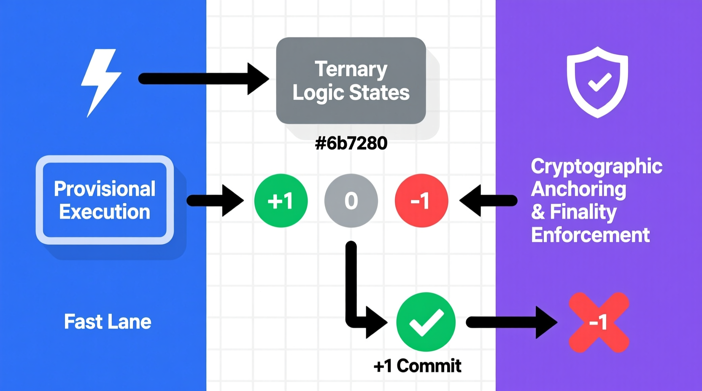
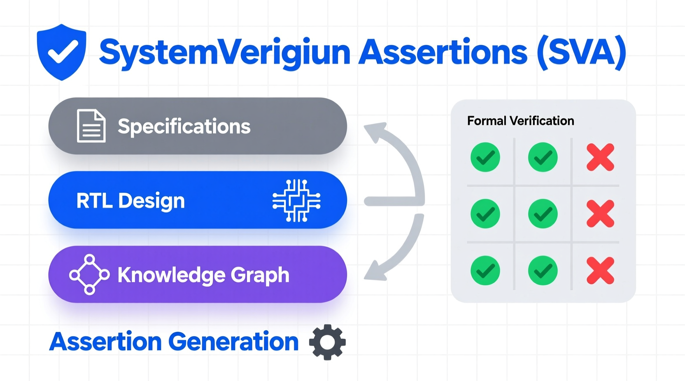

# Dual-Lane Latency Architecture in Ternary Logic (DLLA-TL)

## Abstract and Architectural Overview
The fundamental crisis in contemporary high-frequency execution systems—ranging from algorithmic trading infrastructure to autonomous cyber-physical networks—stems from a structural timing mismatch inherent in bivalent (binary) logic architectures. In these systems, the mandate to maximize throughput and minimize latency necessitates an execution pipeline that settles state transitions at sub-microsecond scales. Conversely, the verification of these transitions, which involves complex cryptographic anchoring, multi-party validation, or regulatory compliance checks, typically requires a temporal window of hundreds of milliseconds. 

This disparity creates a critical "irreversibility gap." When a binary high-frequency execution engine settles a transaction, the state transition is electrically irreversible at the hardware level. The Dual-Lane Latency Architecture (DLLA) resolves this fundamental execution-verification gap by physically separating the execution logic from the finality logic using Delay-Insensitive Ternary Logic (DITL). 

*Figure 1: Visual representation of the Ternary Logic States, demonstrating the bifurcation of provisional execution (Fast Lane) and cryptographic finality enforcement (Audit Lane).*

By abandoning bivalent constraints, the DLLA introduces a physical **Ternary Null (0)** state. This state represents a deterministic, time-bounded "Epistemic Hold." It physically prevents the transition to an irreversible Commit (+1) state until asynchronous convergence is achieved between two distinct pathways:
1. **The Fast Lane (< 2 ms):** A high-speed execution pipeline that calculates operational logic and generates a provisional, non-finalized result.
2. **The Audit Lane (300–500 ms):** A parallel cryptographic pipeline dedicated to hashing, Merkle tree aggregation, and distributed ledger anchoring. 

Finality is strictly hardware-governed by Muller C-elements, making unverified commitments physically impossible without overriding semiconductor physics.

---

## Document Hierarchy and Repository Structure
This repository contains four distinct specifications detailing the DLLA-TL framework. Because the architecture spans queueing theory mathematics, semiconductor physics, and formal hardware verification, the documentation is divided into three functional categories: **Primary Specifications**, the **Executive Overview**, and the **RTL Implementation Archive**. 

To maintain navigational clarity, the original working drafts have been renamed to reflect their specific technical domains. 

### 1. Primary Specifications (The Definitive Hardware Manuals)
These two documents serve as the foundational technical truth for the architecture, designed for peer review by systems engineers and hardware architects.

* **Hardware-Enforceable Execution Model Specification** *(Formerly Report K)*
    * **Focus:** Mathematical rigor, queueing theory, and traffic modeling.
    * **Description:** This specification rigorously models the stability of the Audit Lane buffer under extreme, heavy-tailed burst traffic conditions. By discarding naive M/D/1 queueing assumptions in favor of Markov Modulated Poisson Processes (MMPP) and Pareto distributions, this document mathematically proves that the 500-millisecond audit latency will not result in buffer overflow or pipeline stalling under high-frequency market loads. It also details the flow control policies, backpressure mechanics, and adversarial resistance models required for resilient deployment.

* **Physical Execution and Cryptographic Anchoring Specification** *(Formerly Report P)*
    * **Focus:** Semiconductor realities, physical realization, and ASIC design trade-offs.
    * **Description:** This specification grounds the theoretical logic in physical hardware constraints. It deeply explores the implementation of DITL using dual-rail encoding and addresses the physical area and routing overheads. Crucially, it anticipates near-future semiconductor advancements, outlining how Backside Power Delivery Networks (BPDN) and 2nm/14A node architectures can mitigate the routing congestion of ternary logic. It also provides quantitative power and area estimates for the cryptographic hashing pipelines.

### 2. Executive Overview
* **Hardware-Enforced Execution and Cryptographic Finality** *(Formerly Report T)*
    * **Focus:** High-level architectural briefing and structural necessity.
    * **Description:** Designed for executive stakeholders and systems architects requiring a rapid conceptual baseline, this document distills the core mechanics of the DLLA without overwhelming the reader with transistor-level equations. It effectively contrasts the proposed ternary model against traditional speculative execution, utilizing clear ASCII timing diagrams to demonstrate the resolution of the "tick-to-trade" paradox.

### 3. RTL Implementation Archive
* **A Hardware-Enforceable Model for High-Integrity Financial Systems** *(Formerly Report Q)*
    * **Focus:** Register-Transfer Level (RTL) code and SystemVerilog Assertions.
    * **Description:** While formatted as a continuous supplementary document rather than a formal chapter-based specification, this file is vital for Electronic Design Automation (EDA) synthesis. It contains the raw SystemVerilog implementations for the Muller C-elements, the dual-lane convergence logic, and the commit gating interlocks.

*Figure 2: The formal verification pipeline utilizing SystemVerilog Assertions (SVA) to mathematically prove the impossibility of unverified state commits.*

---

## Complete File Index and Access Links

### Specification 1: Hardware-Enforceable Execution Model
* **Markdown:** [Hardware_Enforceable_Execution_Model_Specification.md](Hardware_Enforceable_Execution_Model_Specification.md)
* **HTML Render:** [Hardware_Enforceable_Execution_Model_Specification.html](https://fractonicmind.github.io/TernaryLogic/Dual_Latency_Architecture/Hardware_Enforceable_Execution_Model_Specification.html)

### Specification 2: Physical Execution and Cryptographic Anchoring
* **Markdown:** `Physical_Execution_and_Cryptographic_Anchoring_Specification.md`
* **HTML Render:** [Physical_Execution_and_Cryptographic_Anchoring_Specification.html](https://fractonicmind.github.io/TernaryLogic/Dual_Latency_Architecture/Physical_Execution_and_Cryptographic_Anchoring_Specification.html)
* **Audio Summary:** [Physical_Execution_and_Cryptographic_Anchoring_Specification.mp3](https://fractonicmind.github.io/TernaryLogic/Dual_Latency_Architecture/Physical_Execution_and_Cryptographic_Anchoring_Specification.mp3)

### Executive Overview: Hardware-Enforced Execution and Cryptographic Finality
* **Markdown:** `Hardware_Enforced_Execution_and_Cryptographic_Finality_Overview.md`
* **HTML Render:** [Hardware_Enforced_Execution_and_Cryptographic_Finality_Overview.html](https://fractonicmind.github.io/TernaryLogic/Dual_Latency_Architecture/Hardware_Enforced_Execution_and_Cryptographic_Finality_Overview.html)
* **Audio Summary:** [Hardware_Enforced_Execution_and_Cryptographic_Finality_Overview.mp3](https://fractonicmind.github.io/TernaryLogic/Dual_Latency_Architecture/Hardware_Enforced_Execution_and_Cryptographic_Finality_Overview.mp3)

### RTL Archive: Model for High-Integrity Financial Systems
* **Markdown:** `Hardware_Enforceable_Model_for_High_Integrity_Financial_Systems.md`
* **HTML Render:** [Hardware_Enforceable_Model_for_High_Integrity_Financial_Systems.html](https://fractonicmind.github.io/TernaryLogic/Dual_Latency_Architecture/Hardware_Enforceable_Model_for_High_Integrity_Financial_Systems.html)

