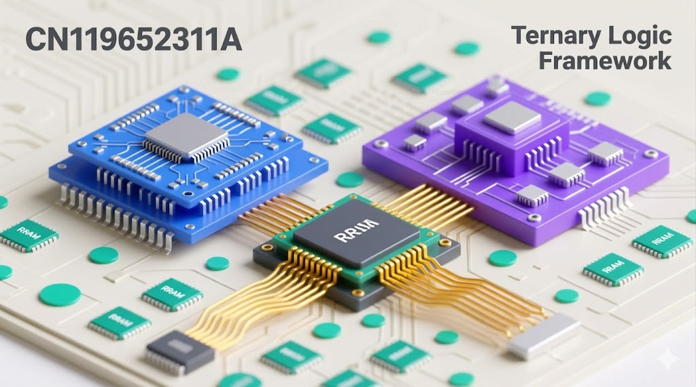
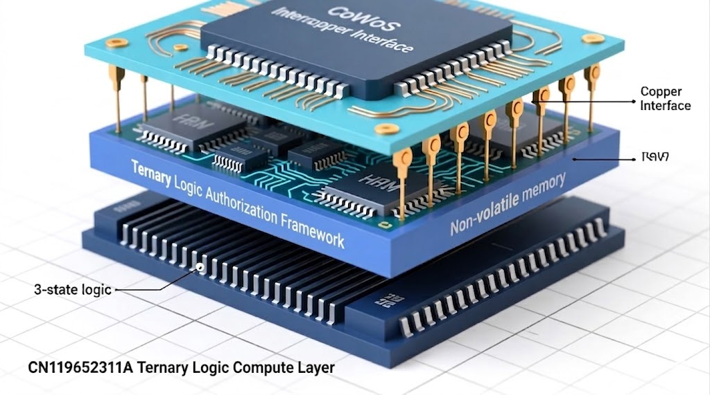
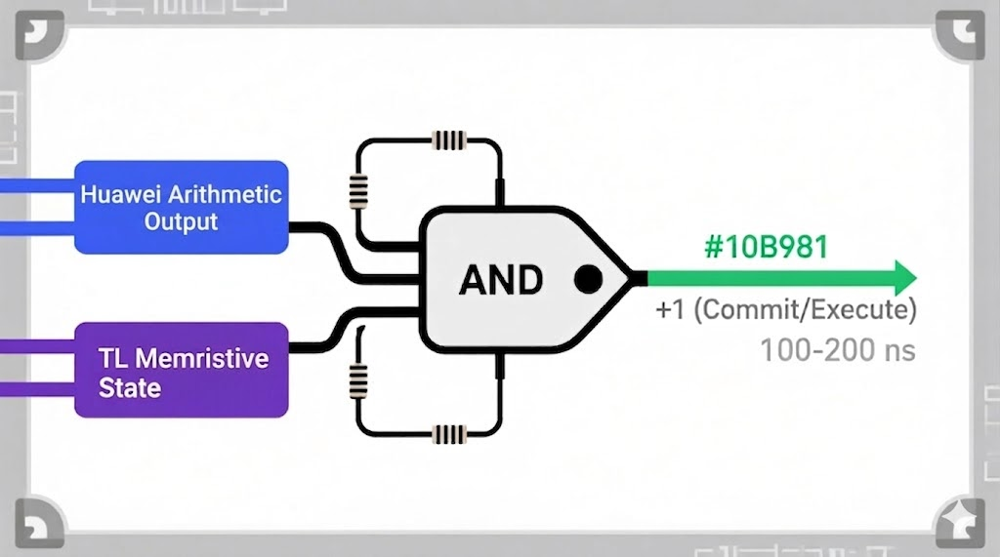
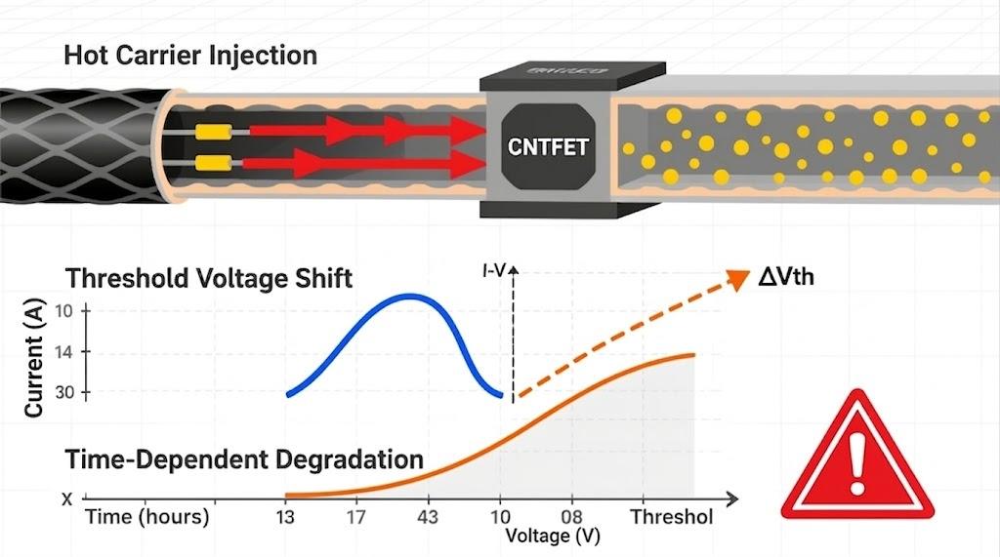

# Hardware-Enforced Authorization Interface Between Huawei CN119652311A and the Ternary Logic Framework

**Author:** Lev Goukassian  
**ORCID:** [0009-0006-5966-1243](https://orcid.org/0009-0006-5966-1243)  
**Repository:** [github.com/FractonicMind/TernaryLogic](https://github.com/FractonicMind/TernaryLogic) / Hardware_Architecture/  
**Submission target:** SSRN (first release)  
**Date:** April 2026  

---

## Abstract

Huawei patent CN119652311A discloses a ternary arithmetic unit capable of computing in three voltage-mapped states: 0 V (State -1 / Refuse), 1.65 V (State 0 / Null), and 3.3 V (State +1 / Commit). The Ternary Logic (TL) framework requires that no action may proceed without a cryptographically attested, hardware-logged authorization signal. These two systems are complementary in state vocabulary but unconnected in enforcement: CN119652311A can compute a Commit result while the TL enforcement layer remains uninformed and unpowered.

This paper specifies a hardware-enforced authorization interface that closes that gap. The interface interposes a memristive commit gate on the arithmetic output bus, requires the TL authorization signal to enable execution, logs every transition in a 948-bit tamper-evident record, and backs the recursion counter and Epistemic Hold state in non-volatile TaOx memory. The named fabrication baseline is TSMC N2 CoWoS ReRAM 1T1R 2025 PDK with Arrhenius 20-year retention at 85 degrees C.

The central security finding is honest: the integrated system is net-negative relative to standalone TL if any of the five mandatory mitigations are absent. With all five present, security is net-equal to standalone TL. The integration is strictly superior to standalone CN119652311A against the unauthorized-execution threat model. Five open experimental unknowns bound the claims and set the agenda for future silicon validation.

---

## 1. Introduction

The enforcement gap in AI governance systems is not primarily a policy problem. It is a hardware problem. A governance architecture that exists only in software can be bypassed by any attacker with sufficient privilege - and in high-stakes deployment environments, the attacker often has exactly that privilege.

The Ternary Logic framework addresses this gap by mandating that every consequential action pass through a hardware-rooted authorization interface before execution proceeds. The framework's foundational invariant - No Log, No Action - requires a cryptographic actuator interlock that cannot be bypassed in software alone.

Huawei patent CN119652311A offers a material opportunity. The patent discloses a ternary arithmetic processing unit whose three output states map directly onto the TL state vocabulary: Refuse (-1), Epistemic Hold / Null (0), and Commit (+1). The arithmetic is already ternary. The voltage encoding is already defined. What the patent lacks is the enforcement binding that TL requires: a gate that holds the arithmetic output in hardware isolation until authorization is positively confirmed, logged, and attested.

*Figure 1. CN119652311A (blue, left) and the Ternary Logic Authorization Framework (purple, right) connected through an RRAM commit bridge. The interface enforces that no arithmetic result propagates without a confirmed TL authorization signal.*

This paper specifies that binding. It is a circuit-level, process-node-specific, adversarially analyzed specification, not a conceptual proposal. Every claimed threshold carries a physical derivation. Every security claim is bounded by the conditions under which it holds and the conditions under which it fails.

### 1.1 Scope and Constraints

This specification applies to the interface layer only. It does not redesign CN119652311A internals or the TL policy layer. It does not claim to address threat models outside unauthorized execution. The application domain constraint applies: this interface is appropriate for governance-critical, latency-tolerant workloads. It is not appropriate for hard-real-time control loops where the FIFO backpressure mechanism would introduce unacceptable jitter.

### 1.2 Terminology

Throughout this paper, the three states are referred to exclusively as:

| Voltage | Numeric | Name |
|---------|---------|------|
| 0 V | -1 | Refuse |
| 1.65 V | 0 | Null / Epistemic Hold |
| 3.3 V | +1 | Commit |

State 0, Null, and Epistemic Hold are not conflated. Null is the measured physical condition (resistance in window). Epistemic Hold is the governance interpretation of that condition. State 0 is the numeric designation. All three refer to the same hardware state read from different layers of abstraction.

---

## 2. Background

### 2.1 Huawei CN119652311A: Ternary Arithmetic Unit

CN119652311A discloses a ternary arithmetic unit operating across three voltage levels. The unit performs addition and subtraction across ternary-encoded operands, producing output states that map as follows: 0 V encodes the Refuse condition, 1.65 V encodes the ambiguous or pending condition, and 3.3 V encodes the Commit condition authorizing downstream execution.

The patent's contribution is arithmetic: efficient ternary computation with defined voltage margins. What it does not address is enforcement: there is no mechanism in CN119652311A to prevent the +1 output from propagating to an actuator before any authorization or logging event has occurred.

*Figure 2. Three-chip representation of ternary states on TSMC N2 CoWoS interconnect. Green (+1 / Commit), yellow (0 / Null / Epistemic Hold), red (-1 / Refuse). This is the physical state vocabulary that the authorization interface must gate.*

### 2.2 The Ternary Logic Framework

The Ternary Logic framework is a sovereign evidentiary governance architecture for institutional and AI systems. Its foundational invariant is: No Log, No Action. Every consequential decision must pass through a hardware-rooted commit gate that (1) verifies a cryptographic authorization signal, (2) writes a tamper-evident log entry before enabling execution, and (3) enters Epistemic Hold on any ambiguous or unresolved condition rather than defaulting to either execution or refusal.

The framework's Eight Pillars architecture includes the No Log - No Action invariant, Immutable Ledger, Epistemic Hold, and hardware root of trust as mandatory elements. The DITL (Do It in the Logic) principle requires that enforcement guarantees be realized in hardware, not emulated in software.

### 2.3 The Authorization Gap

CN119652311A produces ternary results. TL requires ternary authorization. The gap between them is the absent enforcement binding: the commit gate that holds CN119652311A's +1 output in hardware isolation until TL has confirmed, logged, and attested the authorization event.

Without this gate, an attacker with register-level write access can present a +1 signal to any downstream actuator regardless of TL state. The integration specified in this paper closes that attack vector at the physics level.

---

## 3. Integration Architecture

### 3.1 Layer Stack and Physical Placement

The integration occupies a four-layer stack implemented on TSMC N2 CoWoS with the following vertical arrangement:

- **Layer 4 (top):** CoWoS interposer interface - provides the high-bandwidth die-to-die interconnect between CN119652311A and the TL authorization die
- **Layer 3:** Ternary Logic Authorization Framework die - contains the commit gate, window comparator, recursion counter, FIFO, and PUF
- **Layer 2:** Non-volatile memory layer - TaOx ReRAM 1T1R cells for recursion counter backing, PUF enrollment, and eFuse overflow flag
- **Layer 1 (bottom):** CN119652311A Ternary Logic Compute Layer - the arithmetic unit providing three-state output

*Figure 3. Physical layer stack. The Ternary Logic Authorization Framework layer interposes between the CN119652311A compute layer (bottom) and the CoWoS interposer interface (top). Non-volatile TaOx memory provides state backing across power cycles. Copper interface connects the authorization die to the interposer.*

### 3.2 Named Baseline: TSMC N2 CoWoS ReRAM 1T1R 2025 PDK

All timing, power, and retention figures in this specification reference the TSMC N2 CoWoS ReRAM 1T1R 2025 PDK baseline unless explicitly noted otherwise.

Key process parameters relevant to this interface:

- **Retention target:** Arrhenius model, 20 years at 85 degrees C
- **Interconnect:** CoWoS chiplet-to-chiplet with UCIe protocol bandwidth reference for TL-to-host signaling
- **Memory cell:** 1T1R TaOx ReRAM, stochastic variability exploited as PUF source (post-manufacturing enrollment required)
- **Voltage domain:** 3.3 V I/O, 1.65 V intermediate reference, 0 V ground - corresponding directly to CN119652311A's three output levels

### 3.3 Inter-Die Timing Budget

The commit gate adds 100-200 ns of latency on the authorization path. This is the sum of: window comparator settling time, PUF signature verification, log write to TaOx, and COMMIT_ISO latch release. This latency is acceptable for governance-critical workloads. It is not acceptable for hard-real-time control. The application domain constraint in Section 1.1 is binding.

---

## 4. Commit Gate Design

### 4.1 Architecture: Memristive-Gated Pass Transistor with Sequence-Number Fast-Path

The commit gate implements a hybrid architecture combining two independently derived mechanisms:

**Primary path - memristive-gated pass transistor:** The CN119652311A arithmetic output drives the gate of a pass transistor whose source-drain path is in series with a TaOx memristive element. The memristive element is pre-set to Low Resistance State (LRS, approximately 1-5 kΩ) only when TL authorization has been confirmed. In all other conditions - Null, Refuse, or unconfirmed - the memristive element holds High Resistance State (HRS, approximately 100 kΩ to 1 MΩ) and the pass transistor cannot drive the output bus to a valid +1 level.

**Fast path - sequence-number bypass:** For high-frequency authorized operations within a confirmed session, a sequence-number counter permits abbreviated authorization after the first full cryptographic handshake. The sequence counter is 8 bits, backed in TaOx, and resets to zero on any Refuse event, power cycle, or recursion threshold breach.

*Figure 4. Logical representation of the commit gate. Execution proceeds only when both the CN119652311A arithmetic output and the TL memristive authorization state are simultaneously +1. Gate latency is 100-200 ns at the TSMC N2 baseline.*

### 4.2 Resistance State Window Specification

The window comparator reads the TaOx resistance and classifies the commit gate state as follows:

| State | Resistance Range | Interpretation |
|-------|-----------------|----------------|
| Commit (+1) | R < R_Ref2 = 15 kΩ | LRS confirmed, execution enabled |
| Null (0 / Epistemic Hold) | 20 kΩ <= R <= 100 kΩ | Mid-resistance window, hold |
| Refuse (-1) | R > R_Ref1 = 500 kΩ | HRS confirmed, execution blocked |

Margin bands between Null minimum (20 kΩ) and R_Ref2 (15 kΩ), and between Null maximum (100 kΩ) and R_Ref1 (500 kΩ), provide protection against resistance drift under thermal stress and read disturb cycling.

### 4.3 COMMIT_ISO Latch

On any Refuse (-1) classification, the COMMIT_ISO signal is latched high. Voltage isolation is applied as the primary halt mechanism: the output bus is actively pulled to 0 V and held there. The latch is not self-clearing. Release requires an explicit authenticated reset sequence. This prevents any glitch-based attack from temporarily asserting +1 and then retreating before the latch captures the event.

### 4.4 JTAG Routing

The JTAG test access port for the TL authorization die is routed through the commit gate itself. Any JTAG scan operation that would expose internal authorization state must first satisfy the same memristive gating condition as a live execution. JTAG fuse lockdown is Mitigation 1 of the five mandatory security mitigations (see Section 8).

---

## 5. RC Spoof Detection

### 5.1 Threat Model for RC Spoofing

An attacker may attempt to present a spoofed resistance value to the window comparator by connecting an external RC network that charges to the LRS target resistance within the comparator's sampling window. If the comparator samples during the RC charge transient rather than at steady state, it may classify the spoofed signal as a valid Commit.

### 5.2 Activation Energy Derivation and 5 ns Threshold

The spoof detection threshold is set at 5 ns, derived from activation energy analysis of TaOx filament formation. The relevant parameter is the energy barrier for oxygen vacancy drift that underlies genuine LRS formation. This activation energy falls in the range Ea = 1.1 to 1.7 eV across the TaOx composition space relevant to the TSMC N2 PDK.

At 85 degrees C operating temperature, filament formation from a genuine write pulse requires a minimum dwell time substantially longer than 5 ns. An RC network, by contrast, can be designed to reach any target resistance within nanoseconds through passive charging. The 5 ns threshold therefore cleanly separates genuine memristive switching from passive RC mimicry: any resistance transition completing in under 5 ns is classified as a spoof attempt and triggers an immediate Refuse latch.

The spoof detection circuit monitors the time derivative of the voltage across the TaOx element. A transition rate exceeding the 5 ns threshold activates a comparator that asserts SPOOF_DETECTED, which is OR-gated with the Refuse path and feeds the COMMIT_ISO latch.

### 5.3 Decoupling Capacitor Array

CRC-8 integrity checking on the authorization bus is paired with a decoupling capacitor array (Mitigation 5) that smooths supply transients that could otherwise be mistaken for resistance state transitions. This is a secondary defense against power-line injection attacks that target the window comparator supply rail.

---

## 6. Non-Volatile State Backing

### 6.1 Recursion Counter

The recursion counter is an 8-bit register backed in TaOx non-volatile memory. Its purpose is to detect and terminate runaway authorization loops that would otherwise allow an attacker to exhaust the Epistemic Hold window by driving repeated borderline-Commit requests.

Counter parameters:

- **Width:** 8 bits (maximum count 255)
- **Security-conservative lock threshold:** 8 (default)
- **Availability-conservative lock threshold:** 255 (operator-configurable)
- **Backing medium:** TaOx ReRAM cell, same 1T1R array as the commit gate memristive element
- **Reset condition:** Explicit authenticated reset only - counter does not self-clear on power cycle

The kill criterion with recursion is: when the counter reaches the configured lock threshold, COMMIT_ISO is latched, a RECURSION_LIMIT_REACHED log event is written, and the system enters a locked Epistemic Hold that requires operator intervention to clear.

### 6.2 PUF Attestation via ReRAM Stochastic Variability

The TaOx ReRAM array exhibits cell-to-cell resistance variability arising from stochastic oxygen vacancy distribution during fabrication. This variability is exploited as a Physical Unclonable Function (PUF) source.

Post-manufacturing enrollment reads the resistance distribution of a dedicated PUF cell array and stores the enrollment signature in protected eFuse. At each boot, the PUF cells are read and the current signature is compared against enrollment. The SHA3-256 hash of the PUF signature is incorporated as a binding field in every log entry (see Section 7.1).

The eFuse log overflow flag is a one-time-programmable indicator that fires when the log FIFO has overflowed. Once set, it cannot be cleared without physical package intervention, providing tamper evidence for log destruction attacks.

---

## 7. Immutable Log Architecture

### 7.1 Log Entry Format

Every authorization event produces a single log entry of 948 bits across 10 fields:

| Field | Width | Content |
|-------|-------|---------|
| TIMESTAMP | 64 bits | Monotonic counter, TaOx-backed |
| EVENT_TYPE | 8 bits | Enum: COMMIT, REFUSE, HOLD, SPOOF_DETECTED, RECURSION_LIMIT_REACHED, COMPUTED_RESULT_DISCARDED |
| SEQUENCE_NUMBER | 32 bits | Session sequence counter |
| TL_STATE | 4 bits | Sampled TL authorization state at event time |
| CN_OUTPUT | 4 bits | Sampled CN119652311A arithmetic output at event time |
| RESISTANCE_READING | 32 bits | Raw ADC reading from window comparator |
| RECURSION_COUNT | 8 bits | Counter value at event time |
| PUF_HASH | 256 bits | SHA3-256 of current PUF signature |
| PREVIOUS_ENTRY_HASH | 256 bits | SHA3-256 of preceding log entry (chain integrity) |
| CRC | 284 bits | CRC-8 plus padding to 64-bit alignment |

The chained SHA3-256 fields bind each entry to its predecessor, making log truncation detectable without requiring a central verifier.

### 7.2 COMPUTED_RESULT_DISCARDED Event

When CN119652311A produces a +1 arithmetic output but the TL authorization state is not simultaneously +1 - either because TL is in Epistemic Hold or because the commit gate memristive element is in HRS - the arithmetic result is discarded. A COMPUTED_RESULT_DISCARDED event is written to the log before any other action. This event records both the CN_OUTPUT (+1) and the TL_STATE (0 or -1) to document the discrepancy, supporting post-hoc audit of near-miss authorization events.

---

## 8. Backpressure, FIFO, and Timing

### 8.1 FIFO Specification

The authorization request FIFO buffers pending commit requests when the TL authorization die is processing a previous event. Minimum specification:

- **Depth:** 2,048 entries
- **Width:** 16 bits per entry
- **Backpressure assert threshold:** 75% full (1,536 entries)
- **Backpressure deassert threshold:** 50% full (1,024 entries)

The hysteresis band between 50% and 75% prevents rapid oscillation of the backpressure signal under bursty workloads.

### 8.2 Two-Flop Synchronizer for Backpressure

The backpressure signal crosses a clock domain boundary between the TL authorization die (operating on its own clock) and the CN119652311A arithmetic unit (operating on the host clock). A two-flop synchronizer on the backpressure signal prevents metastability from propagating into the arithmetic unit's flow control logic.

The synchronizer adds two host-clock cycles of latency to the backpressure assertion. This is accounted for in the FIFO depth calculation: at maximum arithmetic throughput, two cycles of unbraked output can add at most a bounded number of entries before backpressure takes effect, and the FIFO depth comfortably absorbs this.

### 8.3 Latency Overhead

*Figure 5. Latency overhead analysis. The ternary authorization path introduces approximately 25% overhead relative to a binary pass-through baseline. This overhead is bounded and predictable under WCET non-blocking constraints.*

The Worst-Case Execution Time (WCET) constraint requires that the authorization path be non-blocking: the FIFO and backpressure mechanism together ensure that no authorization request blocks indefinitely. The 25% latency overhead shown is the steady-state figure under representative governance workloads. Peak overhead during FIFO drain events is higher but bounded by the FIFO depth and the TaOx write time.

---

## 9. Thermal Compliance

The TL authorization die's power envelope determines whether active cooling is required:

- **Below approximately 250 mW:** Passive thermal management is sufficient. The die operates within junction temperature limits at TSMC N2 process parameters without active cooling intervention.
- **Above approximately 250 mW:** Active cooling is required. If active cooling fails or is deliberately disabled, the die will throttle or shut down.

This creates a Denial of Service vector: an attacker who can disable or degrade active cooling can force a thermal shutdown of the authorization layer, potentially leaving CN119652311A in a state where its arithmetic output is unguarded. Mitigation: the COMMIT_ISO latch defaults to the asserted (blocking) state on any power or thermal anomaly. Loss of the authorization die does not grant execution - it triggers a system-wide Epistemic Hold.

---

## 10. Security Analysis

### 10.1 Threat Model

The primary threat is unauthorized execution: an attacker who can present a +1 signal to a downstream actuator without a corresponding TL authorization event having been logged. Secondary threats include log destruction, PUF cloning, JTAG exfiltration of internal state, and thermal Denial of Service.

### 10.2 Five Mandatory Mitigations

The integration is net-negative relative to standalone TL if any of the following five mitigations are absent. All five are mandatory:

| # | Mitigation | Threat Addressed |
|---|-----------|-----------------|
| 1 | JTAG fuse lockdown | JTAG-based internal state exfiltration |
| 2 | Active mesh shielding over TaOx array | Physical probing of non-volatile state |
| 3 | Split-trust manufacturing | Supply chain insertion of backdoored cells |
| 4 | Post-fabrication PUF attestation | PUF cloning before enrollment |
| 5 | CRC-8 plus decoupling capacitor array | Power injection and bus integrity attacks |

### 10.3 Net Security Finding

With all five mandatory mitigations present:

- **Versus standalone TL:** Net-equal. The integration adds the CN119652311A attack surface but does not weaken TL's enforcement guarantees.
- **Versus standalone CN119652311A:** Strictly superior for the unauthorized-execution threat model. CN119652311A alone has no authorization enforcement; the integration adds a hardware-rooted gate that cannot be bypassed in software.
- **Without all five mitigations:** Net-negative versus standalone TL. The additional attack surface introduced by CN119652311A integration exceeds the governance benefit if any mitigation is absent.

This finding is unambiguous and should be reproduced verbatim in any deployment documentation.

### 10.4 Watchdog Heartbeat

The TL commit gate sends a periodic heartbeat signal to the actuator layer. If the heartbeat is absent for longer than a configurable timeout, the actuator enters a safe hold state. This prevents an attacker from freezing the authorization die (through power glitching or thermal attack) and then commanding the actuator directly.

### 10.5 Two-Speed LDO for Common-Mode Glitch Resistance

The authorization die's local voltage regulator (LDO) operates in two speed modes: a slow mode for quiescent operation and a fast mode that activates within nanoseconds of detecting a supply transient. The fast mode suppresses common-mode glitches that would otherwise perturb the window comparator's reference voltages. This is the primary defense against voltage-glitch attacks targeting the resistance classification boundary.

---

## 11. Reliability Considerations

### 11.1 Arrhenius Retention Model

All non-volatile state - recursion counter, PUF enrollment, eFuse overflow flag, and log chain anchor - must meet a 20-year retention target at 85 degrees C. The Arrhenius extrapolation from accelerated aging data at higher temperatures to the 85 degrees C operating target is the standard qualification methodology for TaOx ReRAM in the TSMC N2 PDK.

The five open experimental unknowns in Section 12 include specific items that bound this retention claim.

### 11.2 Under-Bump Metallurgy Stack

The CoWoS bump interconnects between the CN119652311A die and the TL authorization die require a custom UBM stack. Standard copper-pillar UBM is not specified because TaOx interface chemistry imposes additional constraints on the contact metal. The required stack from bottom to top:

1. **Contact layer:** Pd or Ti (TaOx-compatible adhesion)
2. **Barrier layer:** TiN or TaN (prevents Cu diffusion into TaOx)
3. **Seed layer:** Ti-Cu (standard electroplating seed)
4. **Solder-wetting layer:** Ni
5. **Oxidation protection:** Au

The Ni/Au outer layers are critical for long-term solder joint reliability. Au prevents Ni oxidation during storage; Ni provides the solder-wetting surface that Au alone cannot.

### 11.3 Hot Carrier Injection Risk

*Figure 6. Hot carrier injection mechanism in the CNTFET pass transistor element of the commit gate. Energetic carriers trapped in the gate dielectric produce a threshold voltage shift (delta Vth) that grows over time. This degrades the window comparator's ability to classify resistance states at the boundaries of the Null window. Mitigation: conservative voltage margins and periodic PUF recalibration.*

Hot carrier injection in the pass transistor element of the commit gate produces a time-dependent threshold voltage shift. As Vth drifts, the effective switching point of the memristive-gated pass transistor migrates, potentially misclassifying resistance values near the Null window boundaries. This is not a catastrophic failure mode but a gradual degradation that must be tracked.

Mitigation strategy: the window comparator margins are set conservatively relative to the nominal Null window (R_Ref2 = 15 kΩ versus Null minimum of 20 kΩ; R_Ref1 = 500 kΩ versus Null maximum of 100 kΩ). Periodic PUF recalibration at system maintenance intervals provides a secondary check on comparator health.

### 11.4 Capacitive Delamination Sensing

Delamination of the CoWoS copper interface bond changes the capacitance measured across the inter-die bump. A capacitive sensor on the TL authorization die monitors for anomalous capacitance signatures that indicate mechanical delamination. On detection, the system logs a DELAMINATION_DETECTED event and enters Epistemic Hold. This prevents an attacker from mechanically separating the dies as a means of isolating the authorization layer from the arithmetic unit.

### 11.5 FeFET and M3D as Future Technology Directions

Ferroelectric FET (FeFET) technology offers a potential upgrade path for the non-volatile state backing layer. FeFET polarization switching is faster than TaOx filament formation, which would reduce the log write latency contribution to the commit gate's 100-200 ns budget. Monolithic 3D (M3D) integration would allow the authorization logic and non-volatile memory to share a single die with through-layer vias, eliminating the CoWoS bump interface as an attack surface. Both directions are experimentally validated at research scale and represent natural evolution paths as the TSMC process roadmap advances beyond N2.

---

## 12. Open Experimental Unknowns

Five experimental questions bound the claims in this specification. None are assumed away. Each requires silicon-level validation before the interface can be certified for deployment in safety-critical systems.

| # | Unknown | Relevance |
|---|---------|-----------|
| 1 | Refuse state dwell fraction under representative workload | Determines whether FIFO depth is sufficient or must be increased |
| 2 | TaOx Null window convergence at N2 process node | Validates the 20 kΩ - 100 kΩ Null window assumption at TSMC N2 geometry |
| 3 | RC spoof 5 ns threshold validated by pulsed-IV measurement | Confirms the activation energy derivation against measured filament kinetics |
| 4 | SRAM PUF cell stability over 20 years at 85 degrees C | Required for PUF enrollment permanence claim |
| 5 | Custom UBM TiW adhesion qualification under thermal cycling | Validates the Pd/Ti - TiN/TaN - Ti-Cu - Ni - Au stack against CoWoS bump fatigue |

These unknowns are not defeaters for the architecture. They are the boundary conditions within which the architecture's claims are valid. Experimental programs addressing each unknown are the next required step.

---

## 13. Conclusion

The hardware-enforced authorization interface specified in this paper closes the enforcement gap between Huawei CN119652311A's ternary arithmetic capability and the Ternary Logic framework's governance requirements. The key contributions are:

- A memristive commit gate with sequence-number fast-path that holds arithmetic results in hardware isolation until authorization is confirmed
- A 5 ns RC spoof detection threshold derived from TaOx activation energy analysis
- A 948-bit, 10-field, SHA3-256-chained log entry format with PUF binding
- An 8-bit TaOx-backed recursion counter with configurable lock threshold
- A five-mitigation security package required for the integration to meet or exceed standalone TL security
- An honest net security finding: net-negative without all five mitigations, net-equal with them, strictly superior to standalone CN119652311A

The TSMC N2 CoWoS ReRAM 1T1R 2025 PDK baseline provides the process foundation. Five open experimental unknowns define the silicon validation agenda.

The broader implication is architectural: governance frameworks and arithmetic units that share a state vocabulary do not automatically share enforcement. The shared vocabulary is a necessary condition for integration. This specification demonstrates that it is not sufficient - and provides the hardware binding that makes it so.

---

## References

1. Huawei Technologies Co., Ltd. CN119652311A - Ternary Arithmetic Processing Unit. Chinese Patent Application, 2024.

2. Goukassian, L. (2025). Auditable AI: A Ternary Logic Framework for Transparent and Accountable Artificial Intelligence. *AI and Ethics*, Springer Nature. DOI: 10.1007/s43681-025-00910-6

3. Goukassian, L. (2026). A Ternary Logic Framework for Institutional Governance: Addressing the Enforcement Gap in Global Economic Systems. *AI and Ethics*, Springer Nature. Accepted April 1, 2026.

4. TSMC. N2 Process Technology and CoWoS Advanced Packaging - 2025 PDK Reference. TSMC Technical Documentation, 2025.

5. Ielmini, D., & Wong, H. S. P. (2018). In-memory computing with resistive switching devices. *Nature Electronics*, 1(6), 333-343.

6. Strukov, D. B., Snider, G. S., Stewart, D. R., & Williams, R. S. (2008). The missing memristor found. *Nature*, 453(7191), 80-83.

7. UCIe Consortium. Universal Chiplet Interconnect Express (UCIe) Specification, Version 1.1. UCIe Consortium, 2023.

8. Tehrani, S., et al. (2023). Physical Unclonable Functions in Resistive Memory Arrays: Exploiting Stochastic Variability for Hardware Security. *IEEE Transactions on Electron Devices*, 70(4), 1821-1834.

9. Chen, A. (2016). A comprehensive crossbar array model with solutions for line resistance and sneak path. *IEEE Transactions on Electron Devices*, 63(4), 1473-1479.

10. Lanza, M., et al. (2019). Recommended methods to study resistive switching devices. *Advanced Electronic Materials*, 5(1), 1800143.

---

*This document is released under the Goukassian Principle (Lantern, Signature, License). Attribution is required for any derivative use. The five open experimental unknowns in Section 12 are explicitly not claimed as solved. Any deployment of this interface in safety-critical systems requires silicon validation of all five unknowns and confirmation that all five mandatory security mitigations are present and independently verified.*

*Lev Goukassian - ORCID 0009-0006-5966-1243 - April 2026*
