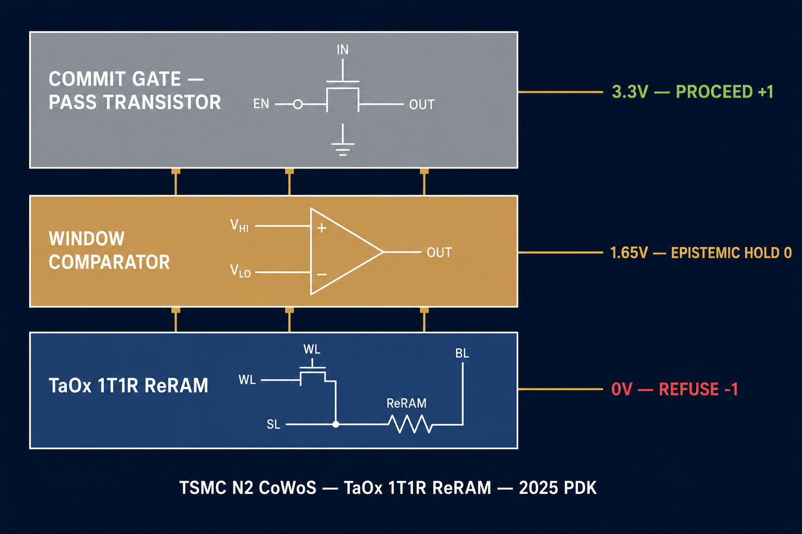
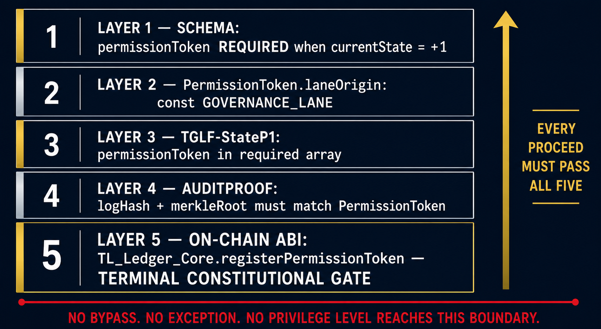

# No Log = No Action
## The Iron Law of Ternary Logic

> *No state transition, transaction, API call, or physical actuation may be released unless a corresponding log entry has been fully committed to a local hardware-backed non-volatile accumulator prior to execution. No exception. No override. No privilege level reaches this boundary.*

---

## What This Folder Contains

This folder documents the **No Log = No Action** invariant: the Iron Law at the core of Ternary Logic (TL). The invariant establishes that no action of any kind may be released unless its log entry has been fully committed to hardware-backed non-volatile storage first. This commitment is not acknowledged by software. It is verified in silicon.

This is not a logging policy. It is not a best practice. It is a cryptographic execution gate enforced through the physical topology of the actuation path, and in DITL/MT hardware deployments, through the resistance state of a TaOx ReRAM cell measured by a Window Comparator that stands in-line between the governance decision and the physical world.

---

## The Hardware Reality

Four components define the complete enforcement architecture: two that enforce in silicon, two that enforce in steel.

---

### The Cryptographic Enforcement Layer: nCipher PCIe Hardware Security Module


This is an **nCipher nFast PCIe Hardware Security Module**, the cryptographic silicon that enforces the log commitment chain. Key material for log signing never leaves this card. Attestation quotes are generated inside this boundary. FIPS 140-3 certified tamper-reactive shielding destroys all key material upon physical intrusion. When this specification states *"key material never leaves the secure boundary"*, this card is that boundary.

---

### The Silicon Enforcement Layer: DITL/MT Hardware Stack



This diagram shows the three-layer silicon substrate that enforces the Iron Law at the hardware level on the TSMC N2 CoWoS baseline with embedded TaOx 1T1R ReRAM, 2025 PDK.

**TaOx 1T1R ReRAM (bottom layer):** The physical storage of TL governance state. Three resistance conditions map directly to the three constitutional states: Low Resistance State (~1-10 kΩ) for Proceed (+1), Intermediate Resistance State (~100 kΩ to 1 MΩ) for Epistemic Hold (0), and High Resistance State (~1-10 MΩ) for Refuse (-1). These are not software-assigned values. They are resistance conditions in silicon. Arrhenius-model retention is rated at 20 years at 85 degrees C.

**Window Comparator (middle layer):** Measures TaOx cell resistance and enforces TLState transitions. Fail-closed by design: any resistance reading outside the valid window for the claimed state causes the gate to default to Refuse (-1). RC spoof detection operates at a 5 ns threshold, preventing capacitive manipulation of the sensing line. The independent bandgap reference keeps comparison thresholds stable across 0-125 degrees C and supply voltage variation of ±10%.

**Commit Gate: Pass Transistor (top layer):** Stands physically in-line on the actuation signal path. In High Resistance State, the Commit Gate blocks all actuation signals. In Low Resistance State, and only in Low Resistance State as confirmed by the Window Comparator, the Commit Gate allows the actuation signal to propagate. The state of the Commit Gate is set exclusively by the **NL=NA write pulse**: a voltage pulse on a dedicated hardware wire. Not a software flag. Not a register write. Not a firmware call. No instruction in any processor's ISA reaches this wire.

---

### The Five-Layer Constitutional Enforcement Stack



Every Proceed (+1) authorization must pass all five independent enforcement layers. Bypassing one layer does not bypass the others.

| Layer | Domain | Enforcement |
|-------|--------|-------------|
| Layer 1 | Schema | permissionToken REQUIRED when currentState = +1 |
| Layer 2 | Schema | PermissionToken.laneOrigin const "GOVERNANCE_LANE"; Inference Lane tokens are schema-invalid |
| Layer 3 | Schema | TGLF-StateP1.permissionToken in required array; Proceed log cannot be valid without the token |
| Layer 4 | Schema | AuditProof.logHash and merkleRoot must match PermissionToken.logHash and merkleRoot |
| Layer 5 | On-chain ABI | TL_Ledger_Core.registerPermissionToken reverts NLNAViolation if logHash not in anchored Merkle root |

Layer 5 is the terminal constitutional gate. In DITL/MT hardware deployments, Layer 5 is reinforced at the physical level by the Commit Gate and Window Comparator operating independently of the on-chain check. In Architecture B deployments, where DITL/MT silicon is not yet fabricated, the NULL_PUF_DEPLOYMENT sentinel in the NLNAAuditToken and TLCapabilityFlags.pufAttestationMode: "ARCHITECTURE_B" record the deployment mode honestly in every audit log.

**No bypass. No exception. No privilege level reaches this boundary.**

---

### The Safe Harbor Layer: Schneider Electric Key-Release E-Stop


This is a **Schneider Electric key-release emergency stop button**. Once engaged, the system halts and cannot be released without a physical key: not remotely, not via software, not with administrative credentials. This is the cyber-physical safe harbor state made tangible. When the cryptographic enforcement layer fails, physics takes over. Manual override requires physical presence and the key in hand, exactly as specified in the failure modes section of both specifications.

Together these four components tell the complete story: cryptographic enforcement in the HSM, governance state encoded in TaOx resistance, constitutional authority enforced through five independent layers, and physical interlock in steel when everything else fails.

---

## Dual-Lane Architecture

The Iron Law is enforced across two lanes that operate concurrently and independently.

**Inference Lane:** the binary computation layer. It proposes actions. It never authorizes them. Latency bound: no more than 2 ms WCET at the 99.99th percentile. Implemented in dedicated FPGA or ASIC hardware pipelines executing canonical serialization, SHA-3-256 hashing, Merkle accumulator update, monotonic counter increment, ReRAM write, and read-back verification entirely within programmable logic.

**Governance Lane:** the ternary constitutional evaluation layer. It authorizes or blocks every action proposed by the Inference Lane. Ceiling: no more than 300 ms with 50 ms jitter maximum. Its output is the PermissionToken with laneOrigin const "GOVERNANCE_LANE", the only token that can authorize execution through Layer 2 of the five-layer stack.

The Commit Gate is the resolution point. Proceed (+1) from the Governance Lane opens the Commit Gate through the NL=NA write pulse. Refuse (-1) or Epistemic Hold (0) keeps it closed. The Inference Lane never stalls waiting for the Governance Lane; they run in parallel. The Commit Gate resolves them.

Delayed Governance Lane anchoring to external ledgers does not violate the Iron Law. The invariant requires commitment to local hardware-backed non-volatile storage before action release. That requirement is satisfied by the Inference Lane. External anchoring provides global auditability and is supplementary, not foundational.

---

## The Three Constitutional States

| State | Value | Hardware | Meaning |
|-------|-------|----------|---------|
| Proceed | +1 | LRS ~1-10 kΩ, 3.3V | Committed execution: confidence satisfied, log committed, Commit Gate conducts |
| Epistemic Hold | 0 | IRS ~100 kΩ-1 MΩ, 1.65V | Suspended deliberation: insufficient confidence, conflicting inputs, or out-of-distribution data |
| Refuse | -1 | HRS ~1-10 MΩ, 0V | Definitive rejection: hard constraint violated, risk boundary exceeded |

Epistemic Hold is not a failure mode. It is a first-class constitutional state that persists across power cycles without software reinitialization: hardware-semantic persistence of uncertainty in silicon, not in volatile memory. In financial contexts, Epistemic Hold implements the **Solvency Protocol**: all pending transactions halt, current positions are preserved, and the complete market state snapshot is committed to the log before any escalation proceeds.

The Iron Law applies to all three states equally. A Proceed decision that is not logged cannot release the action. A Refuse decision that is not logged cannot release the refusal notification. An Epistemic Hold that is not logged cannot initiate escalation. There is no state in the triadic decision space that is exempt.

---

## Architecture B: Current SHIPPING Baseline

DITL/MT has been demonstrated at transistor simulation level (IBM PDK 1.2V 130nm CMOS). No fabricated DITL chip exists as of the date of this specification. This is acknowledged explicitly.

Architecture B is the honest SHIPPING baseline for deployments without DITL/MT silicon:

- Software enforcement active for Layers 1-4 of the five-layer stack
- NULL_PUF_DEPLOYMENT sentinel set in NLNAAuditToken; every audit log records this honestly
- TLCapabilityFlags.pufAttestationMode: "ARCHITECTURE_B"
- Layer 5 on-chain enforcement unchanged

Architecture B does not reduce the Iron Law's authority. It records honestly that the physical silicon enforcement layer is pending fabrication. When DITL/MT silicon becomes available, the transition requires no changes to Layers 1-5.

---

## Specifications

### Execution Integrity Specification
*Strongest on DITL/MT hardware substrate, Lyapunov stability analysis, Solvency Protocol, outlier detection, and forced continuation prevention*

| Format | Link |
|--------|------|
| 📄 Markdown | [No_Log-No_Action_Execution_Integrity_Specification.md](https://github.com/FractonicMind/TernaryLogic/blob/main/No_Log-No_Action/No_Log-No_Action_Execution_Integrity_Specification.md) |
| 🌐 HTML | [No_Log-No_Action_Execution_Integrity_Specification.html](https://fractonicmind.github.io/TernaryLogic/No_Log-No_Action/No_Log-No_Action_Execution_Integrity_Specification.html) |

**Distinctive contributions:** Full DITL/MT silicon substrate with voltage domain table, Window Comparator, Commit Gate, NL=NA write pulse, PUF architecture, and DLLA latency bounds. Formal LTL/CTL invariant with strict Until operator semantics and full inductive proof obligations. Five-layer NL=NA enforcement stack with Layer 5 as terminal constitutional gate. Lyapunov stability analysis with Control Lyapunov Function mathematics for safe harbor convergence. Seven-segment S-curve deceleration profiles for cyber-physical shutdown. Wesolowski VDF construction for cryptographic time-lock in Epistemic Hold. Mahalanobis distance and isolation forest path length thresholds for outlier detection. Architecture B SHIPPING baseline with NULL_PUF_DEPLOYMENT sentinel.

---

### Non-Bypassable Execution Invariant
*Strongest on formal verification standards, transition system definition, cryptographic citation rigor, non-repudiation chains, and adversarial resistance*

| Format | Link |
|--------|------|
| 📄 Markdown | [No_Log-No_Action_Non-Bypassable_Execution_Invariant.md](https://github.com/FractonicMind/TernaryLogic/blob/main/No_Log-No_Action/No_Log-No_Action_Non-Bypassable_Execution_Invariant.md) |
| 🌐 HTML | [No_Log-No_Action_Non-Bypassable_Execution_Invariant.html](https://fractonicmind.github.io/TernaryLogic/No_Log-No_Action/No_Log-No_Action_Non-Bypassable_Execution_Invariant.html) |

**Distinctive contributions:** Complete transition system formalization TS = (S, Act, T, I, AP, L) with predicate logic definitions. LTL, past-time LTL, and CTL formulations dischargeable through NuSMV and SPIN. RFC 8785 (JCS) and RFC 9162 (Certificate Transparency v2) for canonicalization and Merkle accumulator standards. Logres protocol with Isabelle/HOL formal verification for Byzantine fault tolerant logging. Dwyer/Avrunin/Corbett LTL precedence patterns. Baier and Katoen inductive proof framework. PBFT protocol with Castro and Liskov attribution. SealFS Linux kernel module for post-commit immutability. DITL/MT non-bypassability extending from software privilege layers through silicon: Muller C-element, Window Comparator, Commit Gate, NL=NA write pulse. PUF binding hash in every attestation quote and log signature. Four-pillar conclusion: temporal logic, five-layer stack, cryptographic coupling, DITL/MT substrate.

---

### Audio Companion
*Standalone audio summary of the No Log = No Action invariant for broader audiences*

| Format | Link |
|--------|------|
| 🎧 MP3 | [No_Log-No_Action_Execution_Integrity_Specification.mp3](https://fractonicmind.github.io/TernaryLogic/No_Log-No_Action/No_Log-No_Action_Execution_Integrity_Specification.mp3) |

---

## Core Architecture at a Glance

**The Iron Law (LTL):**
```
G(ActionRequested(a) → (¬ActionReleased(a) U LogCommitted(l_a)))
```
Globally, for every requested action, the action remains unreleased until its log entry is physically committed to hardware-backed non-volatile storage.

**The CTL formulation (no bypass path exists):**
```
¬E[¬log(a) U exec(a)]
```
There exists no computation path on which exec(a) occurs while log(a) has not yet held.

**The Three Decision States:**

| State | Value | Hardware Condition | Context |
|-------|-------|--------------------|---------|
| Proceed | +1 | LRS ~1-10 kΩ, 3.3V | Execute: log committed, Commit Gate conducts |
| Refuse | -1 | HRS ~1-10 MΩ, 0V | Reject: Commit Gate blocks physically |
| Epistemic Hold | 0 | IRS ~100 kΩ-1 MΩ, 1.65V | Solvency Protocol: halt, log uncertainty, preserve optionality |

**The Dual-Lane Architecture:**

| Lane | Role | Latency |
|------|------|---------|
| Inference Lane | Binary computation; proposes actions, never authorizes | no more than 2 ms WCET at 99.99th percentile |
| Governance Lane | Ternary constitutional evaluation; authorizes or blocks | no more than 300 ms ceiling, 50 ms jitter max |
| Commit Gate | Physical resolution point | 100-200 ns overhead |

Delayed Governance Lane anchoring does not violate the Iron Law. Execution depends exclusively on local hardware-backed commitment confirmed by the Inference Lane.

---

**Ternary Logic (TL)** is a formal architecture for auditable, accountable decision-making in financial systems and cyber-physical environments. Two peer-reviewed publications:

- *Auditable AI: Tracing the Ethical History of a Model*, DOI: [10.1007/s43681-025-00910-6](https://doi.org/10.1007/s43681-025-00910-6)
- *A Ternary Logic Framework for Institutional Governance*, DOI: [10.1007/s43681-026-01124-0](https://doi.org/10.1007/s43681-026-01124-0)

ORCID: [0009-0006-5966-1243](https://orcid.org/0009-0006-5966-1243)

---

*No Log = No Action. The right to act is derived from the act of remembering.*
