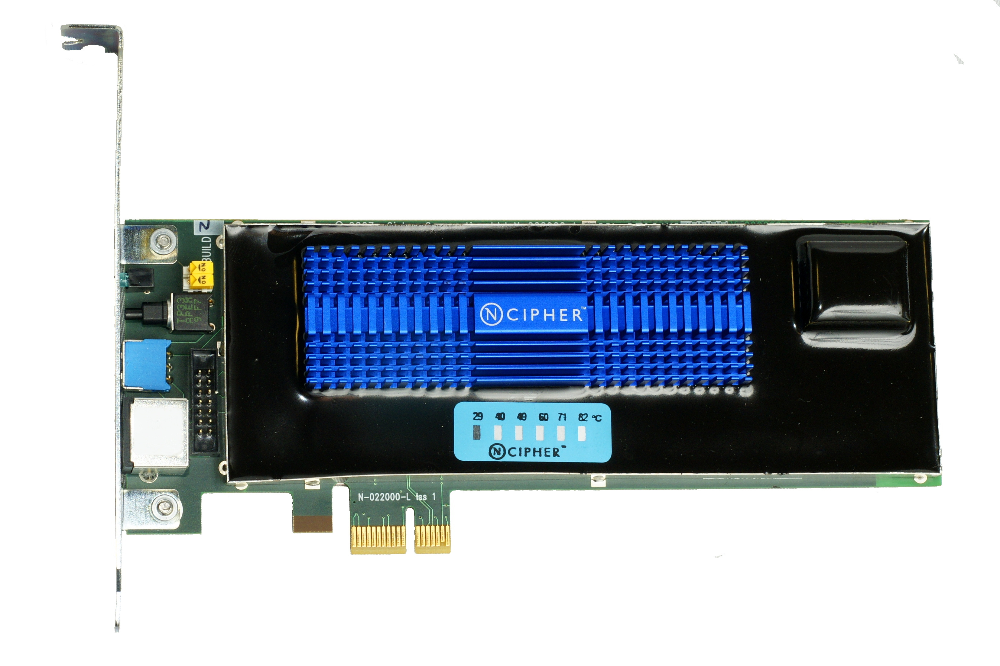

# No Log = No Action
## Execution Integrity Specification — Ternary Logic Core Doctrine

> *If it isn't written in silicon before it moves the world, then the world should not move at all.*

---

## What This Folder Contains

This folder documents the **No Log = No Action** invariant — a non-bypassable architectural constraint at the core of Ternary Logic (TL). The invariant establishes that no state transition, transaction, API call, or physical actuation may be released unless a corresponding log entry has been fully committed to a local hardware-backed non-volatile accumulator prior to execution.

This is not a logging policy. It is a cryptographic execution gate enforced in silicon.

---

## The Hardware Reality

Two images define the complete invariant — one for enforcement, one for failure:

### The Enforcement Layer — nCipher PCIe Hardware Security Module



This is an **nCipher nFast PCIe Hardware Security Module** — the physical silicon that enforces the invariant. Key material for log signing never leaves this card. Attestation quotes are generated inside this boundary. FIPS 140-3 certified tamper-reactive shielding destroys all key material upon physical intrusion. When this specification states *"key material never leaves the secure boundary"* — this card is that boundary.

### The Safe Harbor Layer — Schneider Electric Key-Release E-Stop


This is a **Schneider Electric key-release emergency stop button**. Once engaged, the system halts and cannot be released without a physical key — not remotely, not via software, not with administrative credentials. This is the cyber-physical safe harbor state made tangible: when the cryptographic enforcement layer fails, physics takes over. Manual override requires physical presence and the key in hand — exactly as specified in Section VIII.

Together these two components tell the complete story: cryptographic enforcement in silicon, mechanical interlock in steel.

---

## Specifications

Two independent deep-research specifications are maintained in this folder, produced by different AI systems from the same prompt and preserved for their complementary strengths.

---

### Specification K — Execution Integrity Specification
*Produced by Kimi — strongest on cyber-physical safe harbor, Lyapunov stability analysis, outlier detection, and forced continuation prevention*

| Format | Link |
|--------|------|
| 📄 Markdown | [No_Log-No_Action_Execution_Integrity_Specification.md](https://github.com/FractonicMind/TernaryLogic/blob/main/No_Log-No_Action/No_Log-No_Action_Execution_Integrity_Specification.md) |
| 🌐 HTML | [No_Log-No_Action_Execution_Integrity_Specification.html](https://fractonicmind.github.io/TernaryLogic/No_Log-No_Action/No_Log-No_Action_Execution_Integrity_Specification.html) |

**Distinctive contributions:** Formal LTL/CTL invariant with strict Until operator semantics and full inductive proof obligations. Lyapunov stability analysis with Control Lyapunov Function mathematics for safe harbor convergence. Seven-segment S-curve deceleration profiles for cyber-physical shutdown. Wesolowski VDF construction for cryptographic time-lock in Epistemic Hold. Mahalanobis distance and isolation forest path length thresholds for outlier detection.

---

### Specification C — Non-Bypassable Execution Invariant
*Produced by Claude — strongest on formal verification standards, cryptographic citation rigor, non-repudiation chains, and adversarial resistance*

| Format | Link |
|--------|------|
| 📄 Markdown | [No_Log-No_Action_Non-Bypassable_Execution_Invariant.md](https://github.com/FractonicMind/TernaryLogic/blob/main/No_Log-No_Action/No_Log-No_Action_Non-Bypassable_Execution_Invariant.md) |
| 🌐 HTML | [No_Log-No_Action_Non-Bypassable_Execution_Invariant.html](https://fractonicmind.github.io/TernaryLogic/No_Log-No_Action/No_Log-No_Action_Non-Bypassable_Execution_Invariant.html) |

**Distinctive contributions:** Complete transition system formalization TS = (S, Act, T, I, AP, L) with predicate logic definitions. RFC 8785 (JCS) and RFC 9162 (Certificate Transparency v2) for canonicalization and Merkle accumulator standards. Logres protocol with Isabelle/HOL formal verification for Byzantine fault tolerant logging. Dwyer/Avrunin/Corbett LTL precedence patterns. Baier and Katoen inductive proof framework. SealFS Linux kernel module for post-commit immutability. PBFT protocol with Castro and Liskov attribution.

---

### Audio Companion — 6-Minute Overview
*Produced by Perplexity — standalone audio summary of the No Log = No Action invariant for broader audiences*

| Format | Link |
|--------|------|
| 🎧 MP3 | [No_Log-No_Action_Execution_Integrity_Specification.mp3](https://fractonicmind.github.io/TernaryLogic/No_Log-No_Action/No_Log-No_Action_Execution_Integrity_Specification.mp3) |

An accessible 6-minute audio overview of the invariant — the enforcement architecture, the Epistemic Hold / Solvency Protocol, and the dual-lane commitment model explained for audiences beyond the technical specification.

---

## Core Architecture at a Glance

**The Invariant (LTL):**
```
G(ActionRequested(a) → (¬ActionReleased(a) U LogCommitted(l_a)))
```
Globally, for every requested action, the action remains unreleased until its log entry is physically committed to hardware-backed non-volatile storage.

**The Three Decision States:**
| State | Value | Financial Context |
|-------|-------|-------------------|
| Act | +1 | Execute transaction |
| Refuse | −1 | Reject transaction |
| Epistemic Hold | 0 | Solvency Protocol — halt and log uncertainty |

**The Dual-Lane Architecture:**
- **Fast Lane** — local hardware-backed commitment, sub-2ms latency, sufficient for actuator release
- **Slow Lane** — asynchronous anchoring to distributed ledgers for external auditability

Delayed slow lane anchoring does not violate the invariant. Execution depends exclusively on fast lane local commitment.

---

**Ternary Logic (TL)** framework — a formal architecture for auditable, accountable decision-making in financial systems and cyber-physical environments.

---

*No Log = No Action. The right to act is derived from the act of remembering.*
